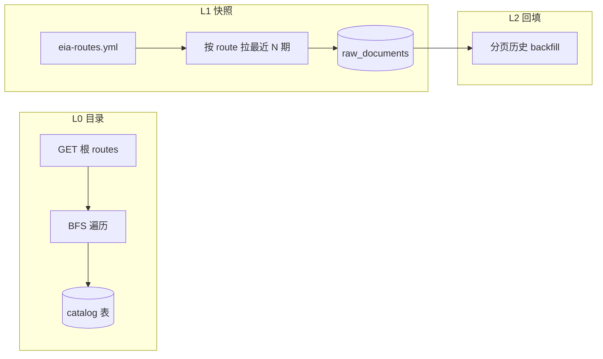

# 树形 API 数据源完备采集方法论

> **状态**：共识知识（EIA 样板已落地）  
> **版本**：v1.0（2026-05-21）  
> **样板实现**：[EIA完备采集方案](../plans/EIA完备采集方案.md) · 代码 `src/connectors/eia/`  
> **文档地图** → [README.md](../README.md)

---

## 1. 适用场景

当外部数据源满足以下特征时，可采用本方法论（**EIA Open Data API v2 为首个落地样板**）：

| 特征 | 说明 |
|------|------|
| **树形 route** | 数据通过 URL 路径分层发现，如 `/v2/electricity/retail-sales/data` |
| **元数据自描述** | 父节点返回 `routes[]` 子节点；叶子节点有 `frequency`、`facets`、`data` 列定义 |
| **观测在 `/data`** | 只有路径以 `/data` 结尾（或等价端点）才返回时间序列行 |
| **强约束** | 单次响应行数上限（EIA：5000）、需 API Key、需限速 |

**不适用**（改用其他模式，见 §7）：

- 扁平搜索选序列（FRED `series/search`、OpenAlex 查询）
- 固定指标清单（World Bank `CORE_INDICATORS`）
- 单端点 + 分页（CrossRef cursor）
- OAI-PMH / SDMX 单 dataset 码表（Eurostat、OECD）

---

## 2. 核心概念：两维「完备」

避免将「完备」混为一谈，必须拆成两个可验收维度：

| 维度 | 含义 | 验收 | data-platform 落点 |
|------|------|------|---------------------|
| **目录完备（L0）** | 所有可发现的叶子 dataset 均有元数据记录 | 本地表/快照与 `GET /v2/` 递归结果一致 | `eia_catalog_routes` · `pnpm cli eia catalog sync` |
| **数据完备（L1+）** | 观测值写入 `raw_documents` | 按 Tier 配置的 route 均有采集 job 成功记录 | `config/eia-routes.yml` · `collect --source eia` |

**结论**：目录完备 ≠ 全库数值完备。全量数值受 API 配额、存储与调度成本约束，通过 **Tier 分层** 控制。

---

## 3. 三阶段流水线（L0 / L1 / L2）



| 阶段 | 目标 | 典型命令 | 写入 |
|------|------|----------|------|
| **L0** | 枚举全部叶子 path、列名、facet、frequency | `pnpm cli eia catalog sync` | `eia_catalog_routes` + `data/catalog/eia-routes-{date}.json` |
| **L1** | 高优先级 route 最近观测（snapshot） | `pnpm cli collect --source eia` | `raw_documents`（`external_id` 含 route + facet） |
| **L2** | 可选历史分页（backfill） | `EIA_COLLECT_MODE=backfill` | 同上，行数受 `eia_backfill_max_rows_per_route` 限制 |

---

## 4. L0 目录同步算法

### 4.1 入口

**禁止硬编码顶层列表**。必须从 API 根响应读取 `routes[]`（EIA：`GET https://api.eia.gov/v2/?api_key=...`），与官网保持一致。

### 4.2 BFS 伪代码

```
queue ← [""]
while queue not empty and requests < MAX:
  path ← pop(queue)
  body ← GET /v2/{path}   # 不要对 /data 无参拉全量
  if body.routes not empty:
    for child in body.routes:
      push(path/child.id)
  else:
    register leaf at path/data
    columns ← body.data 列定义（对象键，非数组）
    optional: probe GET path/data?length=1&data[0]=firstColumn
```

### 4.3 实操陷阱（EIA 二次验证沉淀）

| 陷阱 | 现象 | 对策 |
|------|------|------|
| 无参请求 `/data` | 一次返回数千行 JSON，超时/Abort | L0 **仅**用父节点元数据；probe 必须 `length=1` |
| `frequency` 非数组 | `frequencies?.map is not a function` | `normalizeFrequencyList()` 兼容对象/数组 |
| route 路径漂移 | YAML 404（如 `electricity-power` vs `electric-power`） | `scripts/verify-eia-routes.mjs` 对照 live API |
| `data[0]=value` 硬编码 | 400/空数据（煤价用 `sales`、电力用 `generation`） | 每 route 在 YAML 声明 `data: [...]` |
| probe 卡死 | catalog sync 约 4min 后 abort | 默认 `EIA_CATALOG_SKIP_PROBE=1`；probe 失败不阻断 |
| 长时间无输出 | BFS 可达 2000 次 HTTP（约 2 rps） | stderr 见 `[eia-catalog]` 进度；`EIA_CATALOG_VERBOSE=1` 逐请求 |

### 4.4 目录表字段（可复用到其他源）

| 字段 | 用途 |
|------|------|
| `path` | 叶子唯一键（含 `/data` 后缀） |
| `top_level` | 顶层子模块（`petroleum`、`electricity`…） |
| `tier` / `collect_enabled` | 与 YAML 对齐的采集策略 |
| `needs_facet_plan` | `total > 5000` 时提示需 facet 分片 |
| `skip_reason` | `deprecated` 等（如 `co2-emissions`） |

---

## 5. L1 快照采集：Tier + YAML 真源

### 5.1 Tier 策略

| Tier | 目录 | 数据 L1 | 数据 L2 | 说明 |
|------|------|---------|---------|------|
| **A** | ✅ | ✅ 高频 cron | 可选 backfill | `config/<source>-routes.yml` 显式列出 |
| **B** | ✅ | ✅ 周级 snapshot | 通常不做 | 每顶层选 1–2 个代表 route |
| **C** | ✅ | ❌ | ❌ | 仅元数据，默认 `collect_enabled: false` |
| **D** | ✅ 标记 deprecated | ❌ | ❌ | 官方弃用路径 |

### 5.2 YAML 清单必备字段

```yaml
routes:
  - path: petroleum/pri/spt/data   # 必须与 L0 叶子 path 一致
    tier: A
    collect_enabled: true
    frequency: daily               # 须在 API metadata 中存在
    observations: 30               # snapshot 每 facet 组合最多行数
    data: [value]                  # 必填：API 真实列名
    facets:                        # 可选；笛卡尔积受 max_combos 限制
      sectorid: [RES, COM]
```

### 5.3 `external_id` 契约（去重键）

推荐形态（EIA 已采用）：

```text
{sourceId}/{route}/{facet_signature}/{seriesKey}/{period}
```

- `facet_signature`：无 facet 时为 `_default`
- `seriesKey`：从 `series` 或 product/area/process 组合，避免同 period 碰撞

---

## 6. 验证清单（接入新源或改 YAML 时必跑）

| 步骤 | 命令/动作 | 通过标准 |
|------|-----------|----------|
| 1 | 根节点 HTTP | 顶层 `routes` 数量与官网一致 |
| 2 | `catalog sync` | 无未捕获异常；`topLevelsSeen` 覆盖全部顶层 |
| 3 | `catalog list` | 叶子数合理（EIA 约 200+） |
| 4 | `verify-*-routes` 脚本 | YAML 每条 path 返回 200 且 `data.length≥1` |
| 5 | `collect --source <id> --max-items N` | `raw_json.route` 与 YAML 一致 |
| 6 | `pnpm build` + 相关单测 | exit 0 |

EIA 脚本：`node scripts/verify-eia-routes.mjs`

---

## 7. 其他数据源映射建议

| 源 | 目录 L0 | 数据 L1 | 备注 |
|----|---------|---------|------|
| **EIA** | BFS `routes[]` | YAML 多 route | 本方法论样板 |
| **FRED** | `series/categories` 或搜索索引表 | 已有 `series/search` + observations | 宜建 `fred_series_catalog` |
| **World Bank** | `GET /indicator` 分页 | 扩展 `CORE_INDICATORS` 或目录驱动 | 指标型，非树形 |
| **Eurostat / OECD** | SDMX dataflow 列表 | 每 dataset 一条 indicator | `sdmx_json` profile |
| **OpenAlex / CrossRef** | 无全局树 | 查询驱动 collect | **不适用**本方法论 |
| **OAI 预印本** | setSpec 列表 | 时间窗 harvest | 用 OAI 专章，非 route 树 |

---

## 8. 代码模块模板（复制到新 Connector）

| 职责 | 建议路径 |
|------|----------|
| 目录 BFS | `src/connectors/<id>/catalogCrawl.ts` |
| Facet 规划 | `src/connectors/<id>/facetPlan.ts` |
| 单 route 拉取 | `src/connectors/<id>/routeCollect.ts` |
| 行映射 | `src/connectors/<id>Helpers.ts` |
| 薄编排 | `src/connectors/<id>.ts` |
| 目录表 | `src/storage/migrations/NNN_<id>_catalog.sql` |
| 路由清单 | `config/<id>-routes.yml` |
| CLI | `src/cli/<id>Commands.ts` 或子命令 |
|  live 验证 | `scripts/verify-<id>-routes.mjs` |

**接入点**（与 `ai-task-integration.mdc` §3 一致）：`connectors/index.ts` · `index.ts` registerConnector · `sources.yml` options · `data-sources.md` · migration。

---

## 9. EIA 实证数据（2026-05-21，本机 Key 验证）

| 项 | 结果 |
|----|------|
| API 顶层 | **14** 个：`coal`, `crude-oil-imports`, `electricity`, `international`, `natural-gas`, `nuclear-outages`, `petroleum`, `seds`, `steo`, `densified-biomass`, `total-energy`, `aeo`, `ieo`, `co2-emissions`（deprecated） |
| L0 叶子 | **232** 条（`EIA_CATALOG_SKIP_PROBE=1`，259 HTTP） |
| YAML Tier A/B | **5** 条，live 探测 **5/5 OK** |
| 全库数值 | 未一次性采集；约 227 条叶子仅目录 Tier C |

---

## §变更记录

| 版本 | 日期 | 说明 |
|------|------|------|
| v1.0 | 2026-05-21 | 基于 EIA H0–H2 落地与二次验证：两维完备、L0 陷阱、Tier、验证清单、他源映射 |
