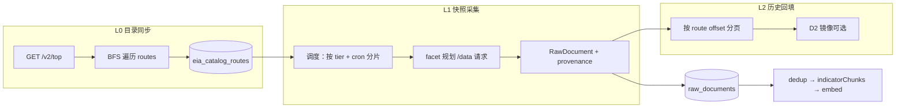

# EIA 完备采集方案

> **状态**：部分落地（H0–H2 MVP）  
> **版本**：v1.2（2026-05-21）  
> **进度真源**：[实施进度总览.md](./实施进度总览.md)（落地后 §3 增 **轨 H：EIA 全量采集**）  
> **方法论（跨源参考）**：[树形API数据源完备采集方法论.md](../knowledge/树形API数据源完备采集方法论.md)  
> **多源排期（Eurostat/FRED/OECD/World Bank）**：[树形API多源完备采集实施方案.md](./树形API多源完备采集实施方案.md)（轨 T）  
> **关联**：[data-sources.md](../data-sources.md) §6.4 · [行业维度接入设计方案.md](./行业维度接入设计方案.md) · [原始数据本地导出与镜像方案.md](./原始数据本地导出与镜像方案.md) · [数据源接入与RAG构建方案.md](./数据源接入与RAG构建方案.md)  
> **文档地图** → [README.md](../README.md)

---

## 1. 目标与范围

### 1.1 平台级目标（上下文）

望野 data-platform 的长期目标是：**每个 Connector 对应的外部 API，其「可发现、可拉取」的数据集应被系统化登记，并按策略持续同步**，而非单点 PoC 路由。

本方案先以 **EIA Open Data API v2** 为样板（树形 REST、多子方向、指标型 RAG），验证「**目录完备 + 数据分层拉取**」模式，后续可复用到 FRED（series 搜索）、Eurostat/OECD（SDMX dataset 列表）等。

### 1.2 EIA 专项目标

| 层级 | 目标 | 验收标准 |
|------|------|----------|
| **L0 目录** | 枚举 API v2 下全部 **叶子 dataset**（含 `.../data` 端点） | `eia_catalog_routes` 表（或等价 JSON 快照）与 `GET /v2/{top}` 递归发现结果一致；每周刷新 |
| **L1 快照** | 每个启用叶子 route 拉取 **最新观测**（可配置 frequency / 观测条数） | `raw_documents` 中 `raw_json.route` 覆盖所有 **Tier A+B** route；`external_id` 稳定去重 |
| **L2 历史** | 对高价值 route **分页回填**历史（受 API 5000 行/次与 Key 配额约束） | 按 route 的 `backfill_status` 可审计；D2 镜像可选落盘 |
| **L3 检索** | `search` 跨 route 元数据 + 已入库序列 | 关键词可命中 `series-description` / 目录 `name` |

### 1.3 非目标

- **不**替代 EIA 官网交互式图表与 PDF 报告（仅 API 返回的序列数据）。
- **不**在首版实现 API v1 全量迁移（仅保留 `seriesid/` **兼容拉取**作为补充通道，见 §5.4）。
- **不**保证「物理意义上每一条历史观测都入库」作为 MVP——受 Key 暂停、存储与调度成本制约；完备性分 **目录完备** 与 **数据深度** 两维配置（§4）。
- **不**在本方案中改望野主包行业 ontology；仅预留 `energy_subsector` 字段供 [行业维度方案](./行业维度接入设计方案.md) 后续接入。

---

## 2. 现状与差距

### 2.1 代码真源（2026-05-21）

| 项 | 现状 |
|----|------|
| Connector | `src/connectors/eia.ts` · `eiaHelpers.ts` |
| 固定路由 | 仅 `petroleum/pri/spt/data`（[`EIA_DEFAULT_ROUTE`](../../src/connectors/eiaHelpers.ts)） |
| 子方向 | **未**遍历 `electricity` / `natural-gas` / `coal` / `renewables` 等顶层树 |
| 行内维度 | `product-name` / `area-name` / `process-name` 写入 `raw_json`，无 `energy_subsector` |
| YAML | `collect_max_items: 5`（[`config/sources.yml`](../../config/sources.yml)） |
| RAG | `indicator` → `indicatorChunks`（短文本一块） |
| DB 视图 | `019_eia.sql` → `economic_indicators` 含 `fred`/`worldbank`/`eia` |

### 2.2 EIA API v2 能力摘要（官网）

依据 [API v2.1.0 技术文档](https://www.eia.gov/opendata/documentation/APIv2.1.0.pdf) 与 [Open Data 门户](https://www.eia.gov/opendata/)：

1. **树形 route**：`https://api.eia.gov/v2/{segment}/...`，父节点返回 `routes[]` 子节点；叶子以 **`/data`** 结尾才返回观测值。
2. **元数据**：对非 `/data` 请求返回 `frequency[]`、`facets`（如 `stateid`、`sectorid`）、列名（`data[]` 参数）。
3. **约束**：单次 JSON 响应 **最多 5000 行**；超限须 `offset`/`length` 分页，或用 `facets`/`start`/`end` 收窄。
4. **发现**：从 `GET /v2/electricity?api_key=...` 等顶层进入，**可编程遍历整棵树**（文档 §「Iterating through the API's tree」）。
5. **兼容**：`GET /v2/seriesid/{APIv1_SERIES_ID}` 可拉取旧版序列 ID。

顶层子方向（与 [API Browser](https://www.eia.gov/opendata/browser/) 一致，实施前应用 L0 目录刷新为准）：

| 顶层 `id` | 含义 | 典型子 route 示例 |
|-----------|------|-------------------|
| `electricity` | 电力 | `retail-sales`, `electricity-power-operational-data`, `facility-fuel`, `rto`, `state-electricity-profiles`, … |
| `natural-gas` | 天然气 | 价格、产量、储运、进出口等 |
| `petroleum` | 石油 | `pri/spt`（现货价）、产量、库存、炼化等 |
| `coal` | 煤炭 | 产量、价格、消费等 |
| `renewable` / `total-energy` 等 | 可再生 / 汇总 | 视目录刷新结果为准 |

---

## 3. 总体架构

### 3.1 三阶段流水线



- **L0** 只写目录表，不调 `/data`（或仅探测性 `length=1` 验证叶子）。
- **L1** 默认生产路径：每叶子 route 拉 **每个逻辑序列** 的最近 `N` 个 period（默认 `N=12`，`frequency` 优先 `monthly`）。
- **L2** 离线/低优先级任务：对标记 `priority=high` 的 route 做全量 `offset` 分页直至 `total` 耗尽。

### 3.2 与现有采集栈的衔接

沿用 [数据源接入与RAG构建方案](./数据源接入与RAG构建方案.md) 主路径：

`Scheduler.runCollection("eia")` → `EiaConnector.collect()` → buffer 200 → `dedup` → `embedDocuments`。

**改造点**：`collect()` 内部改为 **目录驱动的多 route 循环**，而非单一路由分页；`collection_job_events` 增加 `route`、`facet_signature` 字段（日志 JSON 即可，首版不必改表）。

---

## 4. 「完备」的定义与分层策略

### 4.1 两维完备

| 维度 | 含义 | 默认策略 |
|------|------|----------|
| **目录完备** | 所有叶子 route 在本地有记录（id、path、description、facets 元数据） | L0 **必须** 100%（允许 `status=deprecated` 标记） |
| **数据完备** | 每个叶子 route 的观测写入 `raw_documents` | 分 **Tier** 配置覆盖率，避免一次性打满 API |

### 4.2 Route 分层（Tier）

| Tier | 范围 | 采集深度 | 调度 |
|------|------|----------|------|
| **A** | 手工维护 [`config/eia-routes.yml`](#64-configeia-routesyml) **priority: high** | L1 快照 + L2 年度历史（`start` 回溯 10 年） | 日/周 cron |
| **B** | L0 目录中 `priority: medium`（按顶层子方向各选代表 dataset） | 仅 L1 快照（`length=12`） | 周 cron |
| **C** | 其余叶子 route | 仅 L0 元数据；`collect_enabled: false` | 目录刷新时更新 |
| **D** | API 返回 `error` / 无 `data` 列 / 仅 v1 的序列 | 记入 `eia_catalog_routes.skip_reason` | 不采集 |

**Tier A 初始清单（建议 12–20 条叶子）**——实施前用 L0 刷新校验 path 是否存在：

```yaml
# config/eia-routes.yml 片段（设计样例，非真源）
routes:
  - path: petroleum/pri/spt/data
    tier: A
    frequency: daily
    observations: 30
  - path: electricity/retail-sales/data
    tier: A
    frequency: monthly
    facets:
      sectorid: [RES, COM, IND]
      stateid: [CA, TX, NY, CO]
    data: [price, sales]
  - path: electricity/electricity-power-operational-data/data
    tier: A
    frequency: monthly
  - path: natural-gas/pri/sum/data
    tier: B
    frequency: monthly
  # … 由能源 PM 与 L0 目录对齐后扩充
```

### 4.3 Facet 组合爆炸控制

部分 route（如 `electricity/retail-sales`）facet 笛卡尔积可达数千。策略：

1. **默认**：无 YAML 时仅拉 **无 facet 过滤** 的一页（`length=min(5000, max_rows)`），并记录 `catalog.total`；若 `total > 5000`，标记 `needs_facet_plan: true`。
2. **有 YAML**：只拉声明的 facet 组合；`eia_max_facet_combos_per_route`（默认 **64**）硬顶。
3. **序列稳定键**：`facet_signature = hash(sorted facet key-values))`，纳入 `external_id`（§6.2）。

---

## 5. L0：目录同步设计

### 5.1 遍历算法

```
function crawl(parentPath):
  GET /v2/{parentPath}?api_key=
  if response.routes:
    for child in routes:
      crawl(parentPath + "/" + child.id)
  else if parentPath can append /data (probe metadata):
    register leaf at {parentPath}/data
```

- 入口：`electricity`, `natural-gas`, `petroleum`, `coal`, `renewable`, `total-energy`, `international`, `seds`, `state`, `aeo`, …（以 `GET /v2/?api_key=` 返回的顶层 `routes` 为准，**禁止硬编码遗漏**）。
- 速率：复用 Connector `RateLimiter` **2 RPS**；目录任务可与数据采集 **分 job**（避免占满日配额）。
- 幂等：`path` 唯一；`last_catalog_sync_at`、`metadata_json` 全量替换。

### 5.2 目录表（迁移 024）

```sql
-- migration 024: eia_catalog_routes
CREATE TABLE eia_catalog_routes (
  path              TEXT PRIMARY KEY,          -- e.g. electricity/retail-sales/data
  parent_path       TEXT,
  top_level         TEXT NOT NULL,             -- electricity | petroleum | ...
  name              TEXT,
  description       TEXT,
  frequencies       JSONB,                     -- API 返回的 frequency 列表
  facets            JSONB,                     -- facet 定义
  data_columns      JSONB,                     -- 可用 data[] 列
  tier              TEXT NOT NULL DEFAULT 'C', -- A|B|C|D
  collect_enabled   BOOLEAN NOT NULL DEFAULT false,
  needs_facet_plan  BOOLEAN NOT NULL DEFAULT false,
  skip_reason       TEXT,
  last_total_rows   BIGINT,                    -- 探测性请求记录的 response.total
  metadata_json     JSONB,
  last_catalog_sync_at TIMESTAMPTZ NOT NULL DEFAULT NOW(),
  created_at        TIMESTAMPTZ NOT NULL DEFAULT NOW(),
  updated_at        TIMESTAMPTZ NOT NULL DEFAULT NOW()
);

CREATE INDEX idx_eia_catalog_top ON eia_catalog_routes(top_level);
CREATE INDEX idx_eia_catalog_tier ON eia_catalog_routes(tier) WHERE collect_enabled;
```

### 5.3 CLI / Admin

| 命令 | 行为 |
|------|------|
| `pnpm cli eia catalog sync` | 跑 L0，写 `eia_catalog_routes` + 可选 `data/catalog/eia-routes-{date}.json` |
| `pnpm cli eia catalog list [--top petroleum]` | 打印目录统计 |
| `POST /api/admin/eia/catalog/sync` | 同上（内网，与 [热更新方案](./外部数据源配置热更新方案.md) 风格一致） |

---

## 6. L1/L2：数据采集设计

### 6.1 模块划分（代码）

| 模块 | 路径 | 职责 |
|------|------|------|
| 目录爬虫 | `src/connectors/eia/catalogCrawl.ts` | L0 BFS + 写 DB |
| 拉取引擎 | `src/connectors/eia/routeCollect.ts` | 单 route：构参 → 分页 → yield row |
| Facet 规划 | `src/connectors/eia/facetPlan.ts` | YAML + 目录 facets → 请求列表 |
| 行映射 | `src/connectors/eiaHelpers.ts` | 扩展 `mapEiaRowToRawJson` |
| Connector 入口 | `src/connectors/eia.ts` | `collect` 编排；`search` 查目录+已入库 |
| 配置 | `config/eia-routes.yml` | Tier A/B 清单（Git 真源） |
| 测试 | `src/__tests__/unit/eiaCatalog.test.ts` 等 | 固定 fixture 树；禁止 live Key 进 CI |

单文件 ≤200 行：复杂逻辑拆到 `eia/` 子目录，`eia.ts` 保持薄编排。

### 6.2 `external_id` 与 `raw_json` 契约

**external_id**（稳定去重）：

```
eia/{route_path}/{facet_signature}/{period}
```

- `route_path`：不含 `/data` 前缀的叶子逻辑路径，或统一保留 `.../data`（二选一，**全库一致**；推荐 **保留 `/data` 后缀** 与 API 一致）。
- `facet_signature`：无 facet 时为 `_default`。
- `period`：来自 `row.period`。

**raw_json 扩展字段**：

| 字段 | 说明 |
|------|------|
| `route` | 完整 API route（已有） |
| `top_level` | `electricity` / `petroleum` / … |
| `energy_subsector` | 建议 `top_level` 或 `parent_path` 第二段，供行业过滤预留 |
| `facet_signature` | 哈希或规范化字符串 |
| `data_columns` | 本次请求的 `data[]` 列表 |
| `frequency` | 请求 frequency |
| `series` / `series-description` | API 原字段 |
| `catalog_path` | 与 `eia_catalog_routes.path` 对齐 |

### 6.3 单 route 拉取伪代码

```
for each RequestPlan plan in facetPlan(route):
  offset = 0
  loop:
    GET .../{route}?api_key&frequency&data[]&facets&sort&length&offset
    if rows empty: break
    for row in rows:
      yield mapEiaRowToRawJson(row, route, plan.facet_signature)
    offset += rows.length
    if rows.length < length or offset >= total: break
    if mode == snapshot and yielded_per_series >= observations: break
```

- **snapshot 模式**：每个 `facet_signature` 只保留按 `period` desc 的前 `observations` 条（默认 12）。
- **backfill 模式**：不设 `observations` 上限，直到分页结束或达到 `eia_backfill_max_rows_per_route`（默认 50_000，防失控）。

### 6.4 API v1 `seriesid` 补充通道

对 L0 标记 `skip_reason=v2_unavailable` 的序列，维护 **`config/eia-v1-series-ids.txt`**（可选），走：

`GET /v2/seriesid/{SERIES_ID}?api_key=`

映射到相同 `raw_json` 形态，`external_id` 前缀 `eia/seriesid/{SERIES_ID}/{period}`。

### 6.5 `search` 行为

1. 在 `eia_catalog_routes` 上对 `name`、`description` 做 `ILIKE`（或拉 snapshot 进内存索引）。
2. 对已入库 `raw_documents` 用现有 `eiaRowMatchesQuery`。
3. 合并去重，返回 `SearchResult`（`url` 指向 `https://www.eia.gov/opendata/browser/` 对应 path）。

---

## 7. 调度、配额与运维

### 7.1 Job 拆分

| Job ID | 周期 | 内容 |
|--------|------|------|
| `eia-catalog-weekly` | 周日凌晨 | 仅 L0 |
| `eia-snapshot-daily` | 每日（可仅 Tier A） | L1，Tier A routes |
| `eia-snapshot-weekly` | 现有 `0 3 * * 0` | L1，Tier A+B |
| `eia-backfill-manual` | 手动 | L2，单 route 或 top_level |

`sources.yml` 中 **`eia` 保持单 Connector id**；用 `options.collect_mode` 区分（`catalog` | `snapshot` | `backfill`），Scheduler 注册多 cron 时传不同 env/option（见 §8）。

### 7.2 速率与 Key 保护

| 项 | 值 |
|----|-----|
| 客户端 RPS | 保持 **2 RPS**（[`eia.ts`](../../src/connectors/eia.ts)） |
| 目录 BFS | 独立 job；预估顶层 10 × 子树深度 ≤4 → 数百 HTTP；周级可接受 |
| 快照 Tier A+B | 假设 50 route × 平均 4 facet 组合 × 2 页 ≈ 400 请求；2 RPS ≈ **3–4 分钟/job** |
| Key 暂停 | 捕获 `API_KEY_INVALID` / 限流响应 → **整 job 失败**，写 `collection_job_events`，不部分 commit 脏状态 |
| 并发 | **禁止** 多进程同时跑 `eia` collect（PostgreSQL advisory lock 或 job 互斥） |

### 7.3 存储粗算（供决策）

- 假设 L0 发现 **~200** 叶子 route，Tier A+B 启用 **~50** route。
- 每 route 平均 50 序列 × 12 期 ≈ 600 行 → 3 万 `raw_documents` 行（指标型 JSON 小）。
- L2 全历史：部分 route `total` > 10⁵ → 必须 **按 route 启用** + D2 镜像到 `data/raw/eia/`，避免 PG 膨胀。

### 7.4 可观测性

扩展 [采集日志方案](./采集日志与可观测性设计方案.md) NDJSON 字段：

- `eia_route`, `eia_top_level`, `facet_signature`, `page_offset`, `response_total`

`pnpm cli stats` 增 **EIA 覆盖率**：`collect_enabled` 路由中已有 `raw_documents` 的比例。

---

## 8. 配置与环境变量

### 8.1 `config/sources.yml` 扩展（`eia` 源）

```yaml
- id: eia
  profile: rest_query_param_key
  enabled: true
  options:
    collect_mode: snapshot          # catalog | snapshot | backfill
    collect_max_items: 0            # 0 = 不限制（由 tier 与 facet 规划控制）
    eia_routes_file: config/eia-routes.yml
    eia_tier_filter: [A, B]         # snapshot job 采集范围
    eia_default_frequency: monthly
    eia_observations_per_series: 12
    eia_max_facet_combos_per_route: 64
    eia_backfill_max_rows_per_route: 50000
```

### 8.2 新增 ENV（落地时同步 `.env.example` / `CLAUDE.md`）

| 变量 | 必须 | 说明 |
|------|------|------|
| `EIA_API_KEY` | 是 | 已有 |
| `EIA_CATALOG_SYNC_ENABLED` | 否 | `1` 时 Scheduler 注册 `eia-catalog-weekly` |
| `EIA_COLLECT_MODE` | 否 | 覆盖 `collect_mode` |
| `EIA_BACKFILL_ROUTE` | 否 | 手动 backfill 单 route |
| `EIA_TOP_LEVEL_FILTER` | 否 | 逗号分隔，如 `electricity,petroleum` |

### 8.3 `config/eia-routes.yml`

Git 真源：Tier A/B 路由、facet 计划、frequency、observations；L0 目录与之 **diff** 产出 CI 告警（「官网新增 route 未入 Tier」）。

---

## 9. 实施阶段（建议工单）

| Phase | 内容 | 产出 | 依赖 |
|-------|------|------|------|
| **H0** | 迁移 `024` + `catalogCrawl` + `cli eia catalog sync` | 目录表有数据 | `EIA_API_KEY` |
| **H1** | `routeCollect` + `facetPlan` + 扩展 `mapEiaRowToRawJson` | Tier A 的 3–5 条 route 可 snapshot | H0 |
| **H2** | `eia.ts` collect 多 route 编排；`sources.yml` + `eia-routes.yml` | 替换单路由 PoC | H1 |
| **H3** | `search` 接目录；stats 覆盖率 | 检索可发现未采集 route | H2 |
| **H4** | L2 backfill CLI + D2 镜像分 route 目录 | 历史数据可选回填 | H2 |
| **H5** | 行业方案联动：`energy_subsector` + `industry_tag=能源` | [行业维度方案](./行业维度接入设计方案.md) G 轨 | H2 |

**接入点清单**（实施时强制）：

- `src/connectors/index.ts` export（已有）
- `src/index.ts` `registerConnector`（已有）
- `src/cli/index.ts` 子命令 `eia`
- `src/api/routes/admin.ts`（可选 `catalog/sync`）
- `config/sources.yml` · `config/eia-routes.yml`
- `docs/data-sources.md` §6.4 更新
- 测试：`eiaCatalog.test.ts`、`eiaRouteCollect.test.ts`（fixture）

---

## 10. 其它数据源的「全量」复用模式（简表）

| 源 | 目录层（L0） | 数据层（L1+） | 备注 |
|----|--------------|---------------|------|
| **EIA** | `/v2` 树 BFS | `/data` + facet 分页 | 本方案样板 |
| **FRED** | `fred/series/search` + categories | `series/observations` | 已有 search；缺 category 全量登记 |
| **World Bank** | `GET /indicator` 分页 | 按 indicator×country 拉取 | 已有 `CORE_INDICATORS`；可扩为目录表 |
| **Eurostat / OECD** | dataset 列表 API | SDMX JSON 按 key | 与 EIA 同属 indicator 簇 |
| **OpenAlex** | `topics` / `concepts` | 按 C 扫 works | 全量需预算，另案 |

---

## 11. 风险与缓解

| 风险 | 缓解 |
|------|------|
| Key 被 EIA 暂停 | 严格 2 RPS；分 job；监控错误率；Tier C 不拉数据 |
| Facet 笛卡尔积爆炸 | `eia_max_facet_combos_per_route` + YAML 显式白名单 |
| `raw_documents` 膨胀 | Tier 分层；L2 走 D2 镜像；PG 只保留 snapshot |
| 目录与官网不一致 | 周级 L0；`eia-routes.yml` diff CI |
| 重复与 worldbank/fred 宏观指标 | `economic_indicators` 视图已分源；检索用 `source_id` 过滤 |

---

## 12. §变更记录

| 版本 | 日期 | 说明 |
|------|------|------|
| v1.2 | 2026-05-21 | 链入 [树形API完备采集方法论](../knowledge/树形API数据源完备采集方法论.md)；二次验证 14 顶层 / 232 叶子 / YAML 5/5 |
| v1.1 | 2026-05-21 | **H0–H2 落地**：`024_eia_catalog` · `src/connectors/eia/*` · `config/eia-routes.yml` · `pnpm cli eia catalog`；L2 backfill 模式已接、Admin API 未做 |
| v1.0 | 2026-05-21 | 初稿：L0 目录 + L1 快照 + L2 回填；Tier A–D；`eia_catalog_routes`；模块与 Phase H0–H5 |
