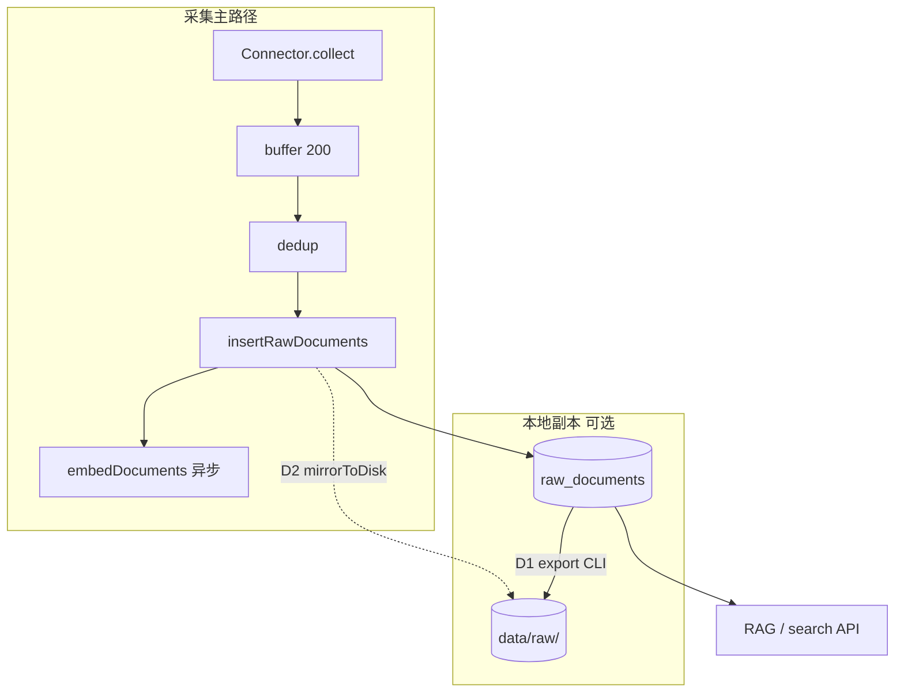

# 原始数据本地导出与采集镜像方案

> **版本**：v1.1 · **状态**：已实施（✅ D1 · ✅ D2 · ✅ D3）  
> **最后更新**：2026-05-19  
> **关联**：[storage-strategy.md](../storage-strategy.md)、[功能实现与设计总览.md](../功能实现与设计总览.md) §7、[design.md](../design.md) §五

---

## 1. 背景与目标

### 1.1 现状

- 采集结果写入 PostgreSQL 表 **`raw_documents`**（`raw_json` JSONB），为检索、去重、Embedding 的**唯一真源**。
- 无 Web/CLI 逐条浏览原始 JSON；运维主要通过 `psql`、`pnpm cli search`（关键词命中）、`pnpm cli stats`（计数）间接查看。
- **无**采集时写本地磁盘、**无**从库批量导出到分类目录的能力。

### 1.2 目标（两者都要）

| 能力 | 代号 | 说明 |
|------|------|------|
| **事后导出** | **D1** | 从 `raw_documents` 按规则导出到宿主机目录，供人工查阅、备份、离线分析 |
| **采集镜像** | **D2** | 新文档入库成功后**可选**同步写同规范目录；开发调试时「采完即可在 Finder 里看到」 |

### 1.3 非目标

- 不以本地文件替代 PostgreSQL 作为主存储（RAG、去重、`ON CONFLICT` 仍以库为准）。
- 不实现全文 PDF/二进制大对象落盘（仅 API 返回的 JSON 元数据/摘要；全文若未来有单独 blob 存储另案）。
- 首版不提供公网无鉴权的 `GET /export` 下载（仅 CLI + 可选内网 Admin API，见 §10.2）。

---

## 2. 设计原则

1. **PostgreSQL 为 canonical**：检索、engine-core、`dedup` 唯一键逻辑不变。
2. **本地目录为副本**：导出/镜像失败**不得**阻断采集主路径（与 `embedDocuments` 相同：异步、仅日志）。
3. **目录规范统一**：D1 导出与 D2 镜像使用**同一套**路径与单文件 JSON 信封（§5），避免两套树。
4. **默认可关**：未设置 `DATA_PLATFORM_RAW_MIRROR` 时 D2 不写盘；D1 由用户显式执行 `pnpm cli export`。
5. **Docker 友好**：镜像目录须通过 compose `volume` 映射到宿主机（§9）。

---

## 3. 架构总览



| 阶段 | 触发 | 写入目标 | 失败策略 |
|------|------|----------|----------|
| D2 镜像 | `insertRawDocuments` 成功后，对 **fresh** 文档 | `DATA_PLATFORM_RAW_MIRROR` | `console.error`，不抛错 |
| D1 导出 | 用户执行 `pnpm cli export` | `--out` 或 `DATA_PLATFORM_EXPORT_DIR` | 命令 exit 1，打印已写条数 |

---

## 4. 目录与文件规范

### 4.1 根目录

| 变量 | 默认值 | 用途 |
|------|--------|------|
| `DATA_PLATFORM_EXPORT_DIR` | `./data/export` | D1 默认输出根 |
| `DATA_PLATFORM_RAW_MIRROR` | （未设置 = 关闭） | D2 镜像根；建议与导出根**相同**（如 `./data/raw`）便于一处管理 |

两能力可共用同一根目录（推荐 `./data/raw`），通过子路径区分「按任务」与「manifest」。

### 4.2 布局模式（`--layout`）

| 模式 | 路径模板 | 适用 |
|------|----------|------|
| **`source`**（默认） | `{root}/{source_id}/{YYYY-MM-DD}/{filename}.json` | 按数据源排查、与 DB `source_id` 一致 |
| **`profile`** | `{root}/_by_profile/{profile}/{source_id}/{YYYY-MM-DD}/{filename}.json` | 按接口类型浏览（profile 来自 `sources.yml` 展开结果或 DB） |

`YYYY-MM-DD` 取自文档 **`fetched_at`**（UTC 日期），与采集任务日历对齐。

**`profile` 与源映射**（导出时查 `data_sources` + 配置缓存；无 profile 时归入 `_unknown`）：

| 逻辑类型 | 典型 `source_id` | 建议 profile 目录名 |
|----------|------------------|---------------------|
| 论文 | openalex, crossref, pubmed, semanticscholar, arxiv | `rest_*` / `ncbi_eutils` / `arxiv_*` |
| 专利 | patentsview | `rest_*` |
| 监管/财报 | sec_edgar | `rest_none` |
| 指标 | fred, worldbank | `rest_*` |
| 试验 | clinicaltrials | `rest_none` |
| 代码/社交 | github, hackernews | `graphql_github` / `firebase_rest` |

> 说明：`profile` 布局是**人类阅读**辅助；去重键仍是 `(source_id, external_id)`，不以 profile 为唯一键。

### 4.3 文件名 `filename`

```
sanitize(external_id) + ".json"
```

- 仅保留 `[a-zA-Z0-9._-]`，其余替换为 `_`。
- 长度上限 **120** 字符；超出则 `{前80}_{sha256前8}`。
- 示例：`W4388723090.json`、`10.1234_example.json`。

### 4.4 单文件 JSON 信封（Envelope）

与 DB 行一一对应，便于 diff 与重新导入（未来可选 `import` 不在本版范围）：

```json
{
  "schemaVersion": 1,
  "id": 42,
  "sourceId": "openalex",
  "externalId": "W4388723090",
  "fetchedAt": "2026-05-19T06:48:00.000Z",
  "collectionJobId": 7,
  "rawJson": { }
}
```

- `rawJson`：与 `raw_documents.raw_json` **字节级一致**（`JSON.stringify` 稳定键序可选，首版不强制）。
- 镜像（D2）在 INSERT 返回 `id` 后写入；导出（D1）从 SELECT 组装。

### 4.5 清单 manifest（D1 每次导出必选；D2 可选追加）

路径：`{root}/_manifest/export-{ISO8601基本格式}.jsonl`

每行一条索引（JSON Lines）：

```json
{"id":42,"sourceId":"openalex","externalId":"W4388723090","relativePath":"openalex/2026-05-19/W4388723090.json","fetchedAt":"2026-05-19T06:48:00.000Z","bytes":4096}
```

D2 可在 `{root}/_manifest/mirror-latest.jsonl` **追加**（或按日滚动 `mirror-2026-05-19.jsonl`），避免单文件无限增长——首版采用 **按日滚动**。

### 4.6 `.gitignore`

```
data/export/
data/raw/
```

文档与示例均假定上述路径**不入库**。

---

## 5. 能力 D1：事后导出（Export）

### 5.1 CLI 规格

```bash
pnpm cli export [选项]

选项:
  --out <dir>           输出根（默认 DATA_PLATFORM_EXPORT_DIR 或 ./data/export）
  --source <id>         仅导出指定 source_id，可重复
  --since <date>        fetched_at >=（ISO 日期 YYYY-MM-DD）
  --until <date>        fetched_at < 次日 0 点
  --job-id <n>          仅 collection_job_id = n
  --layout source|profile
  --overwrite           已存在文件则覆盖（默认跳过并计入 skipped）
  --dry-run             只统计条数，不写盘
  --limit <n>           最多导出 n 条（调试）
```

**示例**：

```bash
pnpm cli export --source openalex --since 2026-05-01 --out ./data/raw
pnpm cli export --job-id 12 --layout profile
pnpm cli export --dry-run
```

### 5.2 实现要点

| 项 | 说明 |
|----|------|
| 数据源 | `DATA_PLATFORM_DATABASE_URL` 直连（与 `migrate` 相同，**不依赖** API 进程） |
| 分页 | `WHERE id > $cursor ORDER BY id LIMIT 500`，避免一次加载全表 |
| 幂等 | 默认 `--overwrite` 未指定时：目标文件已存在 → `skipped++`，manifest 仍记录可选 |
| 进度 | stderr 每 1000 条打印 `exported N / total ~M` |
| 结束码 | 0=成功；1=无可导出或 DB 错误 |

### 5.3 模块

| 路径 | 职责 |
|------|------|
| `src/export/paths.ts` | `buildRelativePath`、`sanitizeExternalId` |
| `src/export/envelope.ts` | `toEnvelope(row)` |
| `src/export/writer.ts` | `writeDocument`、`appendManifest` |
| `src/export/runExport.ts` | 游标查询 + 批写 |
| `src/storage/models/rawDocument.ts` | 新增 `listForExport(filters, cursor)` |
| `src/cli/index.ts` | `case "export"` |

---

## 6. 能力 D2：采集镜像（Mirror）

### 6.1 挂接点

在 `src/processors/dedup.ts` 中，`insertRawDocuments(fresh)` 成功之后：

```typescript
if (process.env.DATA_PLATFORM_RAW_MIRROR) {
  mirrorDocuments(insertedRows, fresh).catch(err => { /* log only */ });
}
```

- 仅对 **本次新插入** 的文档镜像（`skipped` 的已存在文档不重复写，除非后续做「更新也镜像」开关）。
- `insertRawDocuments` 的 `RETURNING` 需保证带 `id`（已有）。

### 6.2 更新策略（`ON CONFLICT` 更新）

当前 DB 对已存在 `(source_id, external_id)` 会 **UPDATE** `raw_json` / `fetched_at`。

| 策略 | 行为 | 首版选择 |
|------|------|----------|
| **skip** | 文件已存在则不写 | 默认（与 dedup skipped 一致） |
| **overwrite** | `DATA_PLATFORM_RAW_MIRROR_OVERWRITE=1` 时覆盖同路径文件 | 可选 env |

路径按**新** `fetched_at` 日期；若跨日更新会在新日期目录出现新文件，旧文件保留（利于审计）。

### 6.3 模块

| 路径 | 职责 |
|------|------|
| `src/export/mirror.ts` | `mirrorDocuments(inserted, rawDocs)`，复用 `writer.ts` |
| `src/processors/dedup.ts` | 调用 mirror（§6.1） |

---

## 7. 一致性与修复

### 7.1 双写不一致场景

| 场景 | 库 | 盘 | 处理 |
|------|----|----|------|
| 镜像写盘失败 | ✅ | ❌ | 日志；可 `pnpm cli export --since …` 补全 |
| 导出中断 | ✅ | 部分 | 重跑 export，`--overwrite` 或依赖跳过策略 |
| 手工删库行 | ❌ | ✅ | 孤儿文件；可选未来 `export --prune`（非首版） |

**真源**：始终以 `raw_documents` 为准；manifest 仅作导出批次索引。

### 7.2 推荐运维习惯

1. 开发机：设置 `DATA_PLATFORM_RAW_MIRROR=./data/raw` + compose volume。
2. 生产：默认**仅 DB**；定期 cron `pnpm cli export --since yesterday` 到备份盘。
3. 需要与同事共享样本：`export --limit 100 --source openalex`。

---

## 8. Docker 部署

### 8.1 compose 片段（设计目标，`docker-compose.yml` 实施时加入）

```yaml
services:
  app:
    environment:
      DATA_PLATFORM_RAW_MIRROR: /data/raw
    volumes:
      - ./data/raw:/data/raw
```

- 宿主机 `./data/raw` 与容器内路径一致映射。
- D1 在宿主机执行 `pnpm cli export` 时，`--out ./data/raw` 与容器镜像目录一致即可对照。

### 8.2 权限

- 进程用户须对 volume 可写；首次启动可自动 `mkdir -p`（`writer.ts`）。

---

## 9. HTTP API（可选，P2）

首版**不强制**；若管理端需要一键打包，可增加（须鉴权，内网）：

| 方法 | 路径 | 说明 |
|------|------|------|
| `POST` | `/api/admin/export` | body: 同 CLI 过滤项；响应 `application/zip` 或异步 job id |

望野 C4 admin 页可后续消费；与 [平台接入设计框架.md](./平台接入设计框架.md) 数据源监控并列，优先级低于 D1 CLI。

---

## 10. 测试与验收

### 10.1 单元测试

| 用例 | 文件 |
|------|------|
| `sanitizeExternalId` 特殊字符 / 超长 | `src/__tests__/export/paths.test.ts` |
| `buildRelativePath` source vs profile | 同上 |
| envelope 字段完整 | `src/__tests__/export/envelope.test.ts` |

### 10.2 集成（可选，需 DB）

1. 插入 fixture `raw_documents` 2 条 → `export --limit 2` → 断言目录 + manifest 行数。
2. `DATA_PLATFORM_RAW_MIRROR=/tmp/dp-mirror-test` → `dedup` 新文档 → 断言文件存在。

### 10.3 验收清单（实施完成时勾选）

- [x] `pnpm cli export --dry-run` 输出待导出条数
- [x] `pnpm cli export --source openalex` 生成 `{root}/openalex/.../*.json` + `_manifest/*.jsonl`
- [x] 设置 `DATA_PLATFORM_RAW_MIRROR` 后 `pnpm cli collect --source crossref` 新文档落盘
- [x] 镜像失败时采集仍 `success`（`mirrorInsertedDocuments` 仅打日志）
- [x] README / `.env.example` 已列变量
- [x] [实施进度总览.md](./实施进度总览.md) D1/D2 标 ✅

**代码路径**：`src/export/*`、`src/cli/index.ts`（`export`）、`src/processors/dedup.ts`、`docker-compose.yml` volume。

---

## 11. 实施计划

| ID | 条目 | 工作量 | 依赖 | 交付 |
|----|------|--------|------|------|
| **D1** | 导出 CLI + `src/export/*` + `listForExport` | ~1d | 无 | `pnpm cli export` |
| **D2** | `mirror.ts` + dedup 挂接 + env | ~0.5d | D1 共用 writer | 采集自动落盘 |
| **D3** | docker-compose volume + README | ~0.25d | D2 | 文档与 compose 一致 |
| **D4** | Admin export API（可选） | ~0.5d | D1 | zip 下载 |

**推荐顺序**：D1 → D2 → D3；（D4 按需）

**优先级**：数据面 **P1**（与 A4 并行）；不阻塞 C2/C3。

---

## 12. 文档与环境变量同步（实施时）

| 动作 | 路径 |
|------|------|
| 示例 env | `.env.example` |
| 运维表 | `CLAUDE.md` 环境变量节 |
| CLI 帮助 | `README.md` §CLI |
| 流水线 | [功能实现与设计总览.md](../功能实现与设计总览.md) §7.2 增 D1/D2 行 |
| 任务矩阵 | [实施进度总览.md](./实施进度总览.md) §3 增 D 轨 |

---

## 变更记录

| 版本 | 日期 | 说明 |
|------|------|------|
| v1.0 | 2026-05-19 | 初稿：D1 导出 + D2 镜像、目录规范、模块划分、Docker/测试/排期 |
| v1.1 | 2026-05-19 | 落地：D1/D2/D3 代码与 compose volume；验收清单勾选 |
