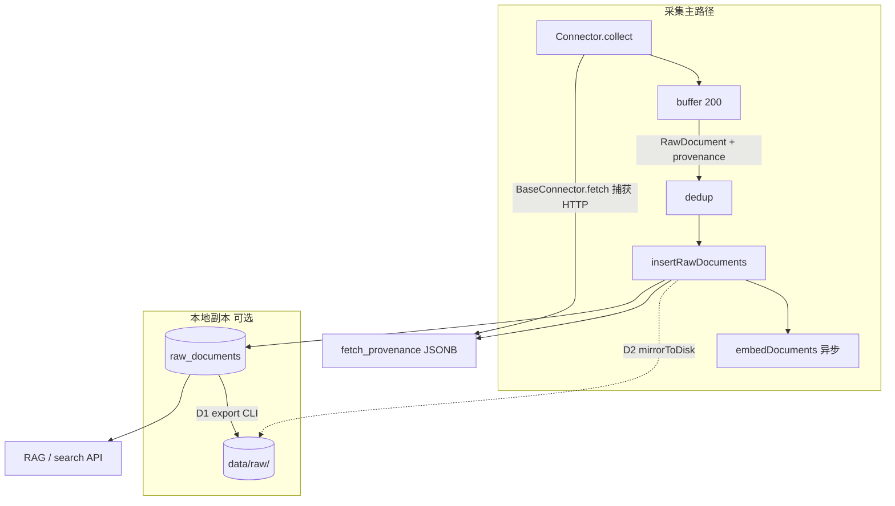
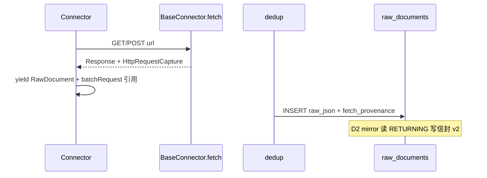

# 原始数据本地导出与采集镜像方案

> **版本**：v1.2 · **状态**：D1–D3 已实施；**D5** 🟡 代码已落地（需 `migrate` + 新采集才有库内 provenance）  
> **最后更新**：2026-05-19  
> **关联**：[storage-strategy.md](../storage-strategy.md)、[实施进度总览.md](./实施进度总览.md) §3 D 轨、[design.md](../design.md) §五

---

## 1. 背景与目标

### 1.1 现状

- 采集结果写入 PostgreSQL 表 **`raw_documents`**（`raw_json` JSONB），为检索、去重、Embedding 的**唯一真源**。
- 无 Web/CLI 逐条浏览原始 JSON；运维主要通过 `psql`、`pnpm cli search`（关键词命中）、`pnpm cli stats`（计数）间接查看。
- **无**采集时写本地磁盘、**无**从库批量导出到分类目录的能力。

### 1.2 目标（两者都要）

| 能力 | 代号 | 说明 |
|------|------|------|
| **事后导出** | **D1** | 从 `raw_documents` 按规则导出到宿主机目录，供人工查阅、备份、离线分析 |
| **采集镜像** | **D2** | 新文档入库成功后**可选**同步写同规范目录；开发调试时「采完即可在 Finder 里看到」 |

### 1.3 非目标

- 不以本地文件替代 PostgreSQL 作为主存储（RAG、去重、`ON CONFLICT` 仍以库为准）。
- 不实现全文 PDF/二进制大对象落盘（仅 API 返回的 JSON 元数据/摘要；全文若未来有单独 blob 存储另案）。
- 首版不提供公网无鉴权的 `GET /export` 下载（仅 CLI + 可选内网 Admin API，见 §10.2）。

---

## 2. 设计原则

1. **PostgreSQL 为 canonical**：检索、engine-core、`dedup` 唯一键逻辑不变。
2. **本地目录为副本**：导出/镜像失败**不得**阻断采集主路径（与 `embedDocuments` 相同：异步、仅日志）。
3. **目录规范统一**：D1 导出与 D2 镜像使用**同一套**路径与单文件 JSON 信封（§5），避免两套树。
4. **默认可关**：未设置 `DATA_PLATFORM_RAW_MIRROR` 时 D2 不写盘；D1 由用户显式执行 `pnpm cli export`。
5. **Docker 友好**：镜像目录须通过 compose `volume` 映射到宿主机（§9）。

---

## 3. 架构总览



| 阶段 | 触发 | 写入目标 | 失败策略 |
|------|------|----------|----------|
| D2 镜像 | `insertRawDocuments` 成功后，对 **fresh** 文档 | `DATA_PLATFORM_RAW_MIRROR` | `console.error`，不抛错 |
| D1 导出 | 用户执行 `pnpm cli export` | `--out` 或 `DATA_PLATFORM_EXPORT_DIR` | 命令 exit 1，打印已写条数 |

---

## 4. 目录与文件规范

### 4.1 根目录

| 变量 | 默认值 | 用途 |
|------|--------|------|
| `DATA_PLATFORM_EXPORT_DIR` | `./data/export` | D1 默认输出根 |
| `DATA_PLATFORM_RAW_MIRROR` | （未设置 = 关闭） | D2 镜像根；建议与导出根**相同**（如 `./data/raw`）便于一处管理 |

两能力可共用同一根目录（推荐 `./data/raw`），通过子路径区分「按任务」与「manifest」。

### 4.2 布局模式（`--layout`）

| 模式 | 路径模板 | 适用 |
|------|----------|------|
| **`source`**（默认） | `{root}/{source_id}/{YYYY-MM-DD}/{filename}.json` | 按数据源排查、与 DB `source_id` 一致 |
| **`profile`** | `{root}/_by_profile/{profile}/{source_id}/{YYYY-MM-DD}/{filename}.json` | 按接口类型浏览（profile 来自 `sources.yml` 展开结果或 DB） |

`YYYY-MM-DD` 取自文档 **`fetched_at`**（UTC 日期），与采集任务日历对齐。

**`profile` 与源映射**（导出时查 `data_sources` + 配置缓存；无 profile 时归入 `_unknown`）：

| 逻辑类型 | 典型 `source_id` | 建议 profile 目录名 |
|----------|------------------|---------------------|
| 论文 | openalex, crossref, pubmed, semanticscholar, arxiv | `rest_*` / `ncbi_eutils` / `arxiv_*` |
| 专利 | patentsview | `rest_*` |
| 监管/财报 | sec_edgar | `rest_none` |
| 指标 | fred, worldbank | `rest_*` |
| 试验 | clinicaltrials | `rest_none` |
| 代码/社交 | github, hackernews | `graphql_github` / `firebase_rest` |

> 说明：`profile` 布局是**人类阅读**辅助；去重键仍是 `(source_id, external_id)`，不以 profile 为唯一键。

### 4.3 文件名 `filename`

```
sanitize(external_id) + ".json"
```

- 仅保留 `[a-zA-Z0-9._-]`，其余替换为 `_`。
- 长度上限 **120** 字符；超出则 `{前80}_{sha256前8}`。
- 示例：`W4388723090.json`、`10.1234_example.json`。

### 4.4 单文件 JSON 信封（Envelope）

与 DB 行一一对应，便于 diff 与重新导入（未来可选 `import` 不在本版范围）。

**`schemaVersion: 1`（当前已落地）**——无溯源字段：

```json
{
  "schemaVersion": 1,
  "id": 42,
  "sourceId": "openalex",
  "externalId": "W4388723090",
  "fetchedAt": "2026-05-19T06:48:00.000Z",
  "collectionJobId": 7,
  "rawJson": { }
}
```

**`schemaVersion: 2`（D5 目标）**——在顶层增加可选 `provenance`，**不得**修改 `rawJson` 结构或内容：

```json
{
  "schemaVersion": 2,
  "id": 9509,
  "sourceId": "pubmed",
  "externalId": "42136967",
  "fetchedAt": "2026-05-19T08:40:43.000Z",
  "collectionJobId": 15,
  "provenance": { },
  "rawJson": { }
}
```

| 字段 | 约束 |
|------|------|
| `rawJson` | 与 `raw_documents.raw_json` **完全一致**；D5 不写入、不包裹、不增删键 |
| `provenance` | 与 `raw_documents.fetch_provenance` 一致（见 §4.7）；无数据时可省略（导出旧行）或 `null` |
| `schemaVersion` | `1` = 历史文件；`2` = 含溯源契约；读方应兼容 `provenance` 可选 |

- 镜像（D2）在 INSERT 返回 `id` 后写入；导出（D1）从 SELECT 组装 `raw_json` + `fetch_provenance`。
- **向后兼容**：D1/D2 对 `schemaVersion: 1` 且无 `fetch_provenance` 的行仍输出 v1 信封；有库内溯源或 Connector 回退模板时升为 v2。

### 4.5 清单 manifest（D1 每次导出必选；D2 可选追加）

路径：`{root}/_manifest/export-{ISO8601基本格式}.jsonl`

每行一条索引（JSON Lines）：

```json
{"id":42,"sourceId":"openalex","externalId":"W4388723090","relativePath":"openalex/2026-05-19/W4388723090.json","fetchedAt":"2026-05-19T06:48:00.000Z","bytes":4096,"schemaVersion":2,"hasProvenance":true}
```

| 字段（D5 增） | 说明 |
|---------------|------|
| `schemaVersion` | 对应单文件信封版本（1 或 2） |
| `hasProvenance` | 是否存在非空 `provenance`（含仅 `documentRequest` 的回退模板） |

D2 可在 `{root}/_manifest/mirror-latest.jsonl` **追加**（或按日滚动 `mirror-2026-05-19.jsonl`），避免单文件无限增长——首版采用 **按日滚动**。

### 4.6 `.gitignore`

```
data/export/
data/raw/
```

文档与示例均假定上述路径**不入库**。

### 4.7 数据来源溯源（Provenance，D5）

> **目标**：在导出 JSON 与数据库中提供**结构化、可机器解析**的 HTTP 复现信息，并**派生**人类可执行的 `curl`；**不修改** `rawJson`。  
> **两种复现语义**必须同时支持（批量 API 下 1 次 HTTP 对应 N 条文档）。

#### 4.7.1 设计原则

| # | 原则 |
|---|------|
| P1 | **结构化为主**：`method` / `url` / `headers` / `body` 为真源；`curl` 由工具函数生成，禁止只存 curl 字符串 |
| P2 | **不改 rawJson**：溯源独立字段 `fetch_provenance`（库）与信封 `provenance`（盘） |
| P3 | **单条 + 批次**：`documentRequest`（按 `externalId` 重拉一条）与 `batchRequest`（采集时真实 HTTP）并存 |
| P4 | **采集时捕获为准**：`batchRequest` 仅在 `Connector.collect` / `BaseConnector.fetch` 路径写入；导出时不得伪造 WebEnv/cursor |
| P5 | **凭证脱敏**：`api_key`、`Authorization` 等写入库/盘前必须 `REDACTED` 或省略；`curl` 同样脱敏 |
| P6 | **失败不阻断**：写 `fetch_provenance` 失败不得导致采集 `failed`（与 D2 mirror 相同） |
| P7 | **历史可部分回填**：无库内溯源时，Connector 可提供 `documentRequest` **模板**（标注 `synthetic: true`） |

#### 4.7.2 类型契约（TypeScript 逻辑名）

```typescript
/** 单次 HTTP 请求的可复现描述 */
interface HttpRequestCapture {
  method: "GET" | "POST" | "PUT" | "DELETE";
  url: string;
  /** 已脱敏；禁止出现明文 api_key / Bearer token */
  headers?: Record<string, string>;
  /** POST/PUT 体；JSON 对象或 redacted 占位 */
  body?: unknown;
  /** 由 method/url/headers/body 派生，供运维直接粘贴终端 */
  curl: string;
  /** 如 NCBI WebEnv、OpenAlex cursor：过期后 curl 可能 4xx */
  ephemeral?: boolean;
}

/** 信封 / DB 共用：fetch_provenance 与 provenance 同构 */
interface DocumentProvenance {
  provenanceSchemaVersion: 1;
  capturedAt: string; // ISO8601，采集时钟
  connectorId: string; // 同 sourceId
  connectorVersion?: string; // package 或 git describe，可选
  license?: string;
  commercialUse?: boolean;
  /** 人类可读落地页，非 API URL */
  canonicalUrl?: string;
  /** 采集任务上下文（非 HTTP） */
  collect?: {
    jobId?: number;
    mode?: "incremental" | "search" | "by_id";
    since?: string;
    query?: string;
    /** Connector 侧完整检索式，如 PubMed esearch term */
    term?: string;
  };
  /** 单条复现：仅拉取当前 externalId */
  documentRequest?: HttpRequestCapture & { synthetic?: boolean };
  /** 批次复现：采集时真实发出的 HTTP（同批文档共享同一对象） */
  batchRequest?: HttpRequestCapture & {
    batchIndex?: number;
    documentIndexInBatch?: number;
    documentsInBatch?: number;
  };
}
```

- `synthetic: true`：表示 `documentRequest` 由 `externalId` + 当前配置**事后推导**，非当时抓包（D1 导历史行、或采集时捕获失败时的回退）。
- `batchRequest` 缺失：旧数据、或非批量源（每 yield 一次请求一条）时可省略。

#### 4.7.3 语义对照：单条 vs 批次

| 维度 | `documentRequest` | `batchRequest` |
|------|-------------------|----------------|
| 用途 | 核对**这一篇**是否与 API 一致 | 审计**这一批**采集时的真实调用 |
| PubMed 示例 | `esummary.fcgi?id=42136967&retmode=json` | `esummary.fcgi?WebEnv=…&retstart=400&retmax=200` |
| OpenAlex 示例 | `GET /works/W4388723090` | `GET /works?filter=from_publication_date:…&cursor=…` |
| 是否常过期 | 一般可长期复用 | `ephemeral: true`（WebEnv/cursor） |
| 1:N | 1 请求 : 1 文档 | 1 请求 : 最多 per_page 条文档 |

同一 `batchRequest` 对象可在同批入库的 N 行 `fetch_provenance` 中**重复存储**（JSONB 冗余可接受）；manifest 不展开 HTTP，仅 `hasProvenance`。

#### 4.7.4 数据库：`raw_documents.fetch_provenance`

迁移 **`010_fetch_provenance.sql`**（✅ 已入库；collect 侧 🟡 仅 openalex/crossref/pubmed/arxiv_oai 挂 `attachProvenance`）：

```sql
ALTER TABLE raw_documents
  ADD COLUMN IF NOT EXISTS fetch_provenance JSONB;

COMMENT ON COLUMN raw_documents.fetch_provenance IS
  'HTTP 溯源：documentRequest + batchRequest + collect 上下文；与 raw_json 独立';
```

| 项 | 说明 |
|----|------|
| 可空性 | `NULL` = 未采集溯源（历史行、或关闭捕获） |
| 写入时机 | `insertRawDocuments` 的 INSERT 参数；**不在** `ON CONFLICT` 更新路径覆盖（保持「跳过重复不改 raw_json」；若未来支持 UPDATE raw_json，须单独定义 provenance 是否刷新） |
| 与 `raw_json` | **无外键/合并**；应用层 `toEnvelope` 分别 SELECT |
| 体积 | 单行约 0.5–2KB；不建 GIN（无检索需求）；可选 CHECK `jsonb_typeof(fetch_provenance) = 'object'` |

**`RawDocument` / 入库行扩展**（`src/types.ts`、`src/storage/models/rawDocument.ts`）：

- 采集：`RawDocument.fetchProvenance?: DocumentProvenance`
- 查询导出：`RawDocumentRow.fetchProvenance` 从列映射

#### 4.7.5 采集路径：捕获与挂接



| 模块 | 职责 |
|------|------|
| `src/lib/httpCapture.ts`（新） | `captureFromFetch(url, init, res?)` → `HttpRequestCapture`；`toCurl(capture)`；`redactUrl(url)` |
| `src/connectors/base.ts` | `fetch` / `fetchPost` 返回 `{ response, capture }` 或写入 `lastCapture` 供子类读取 |
| 各 Connector | `collect` 每批请求后，为 yield 的每条文档附加相同 `batchRequest`；`toRawDocument` 填充 `documentRequest`（可调用 `buildDocumentRequest(externalId)`） |
| `src/connectors/provenance/`（新，可选） | 各源 `buildDocumentRequest` / `canonicalUrl` 模板，供回退与单测 |
| `src/processors/dedup.ts` | 透传 `fetchProvenance` 至 `insertRawDocuments` |
| `src/export/envelope.ts` | `toEnvelope`：`schemaVersion: 2` 当 `fetchProvenance` 非空或回退模板存在 |

**批次索引**：Connector 在 `collect` 循环内维护 `batchIndex`（从 0 递增）、批内 `documentIndexInBatch`，写入 `batchRequest`。

#### 4.7.6 `curl` 生成规则（派生字段）

1. 使用 `curl -sS`；GET 默认不写 `-X`。
2. `-H 'User-Agent: …'` 保留（NCBI polite pool）；密钥类 Header **不输出**或 `REDACTED`。
3. POST：`curl -sS -X POST -H 'Content-Type: application/json' -d '{...}' 'url'`；body 中密钥字段替换为 `"REDACTED"`。
4. URL query 中 `api_key=`、`key=`、`token=` 替换为 `REDACTED`（保留参数名便于人工替换）。
5. Shell 单引号转义：URL 内 `'` → `'\''`。

#### 4.7.7 各 Connector 最小模板（实施参考）

| `source_id` | `documentRequest` | `batchRequest` | `canonicalUrl` |
|-------------|-------------------|----------------|----------------|
| `pubmed` | `esummary.fcgi?db=pubmed&id={pmid}&retmode=json&tool=…` | `esummary` + `WebEnv` + `retstart` + `retmax` | `https://pubmed.ncbi.nlm.nih.gov/{pmid}/` |
| `openalex` | `GET {base}/works/{id}` | `GET {base}/works?filter=…&cursor=…` | OpenAlex `id` URL 或 DOI 落地页 |
| `crossref` | `GET /works/{doi}` | 分页 `cursor` / `offset` | `https://doi.org/{doi}` |
| `worldbank` | 指标/序列单条 API | 列表分页 | 世行数据页（若有） |

未实现 Connector 的源：**不**在导出阶段伪造 `batchRequest`；仅当存在 `fetch_provenance` 或已注册 `buildDocumentRequest` 时输出 v2。

#### 4.7.8 导出（D1）与镜像（D2）行为

| 场景 | 信封 `schemaVersion` | `provenance` |
|------|----------------------|--------------|
| DB 有 `fetch_provenance` | 2 | 原样输出 |
| DB 为 NULL，Connector 提供回退模板 | 2 | `documentRequest` + `synthetic: true`；无 `batchRequest` |
| 均无 | 1 | 省略（与现网一致） |

CLI 可选（P2）：`pnpm cli export --provenance fallback|strict` — `strict` 时无溯源行计入 `skippedProvenance` 统计。

#### 4.7.9 安全与合规

- 禁止将 `process.env.NCBI_API_KEY` / `OPENALEX_API_KEY` 明文写入 JSON 或 curl。
- 审计日志（`collection_job_events`）可记录 `batchIndex`、URL **path**（无 query 密钥），完整 URL 仅存 `fetch_provenance`。
- 对外分享导出目录前，脚本应可 `pnpm cli export --redact`（P2，复用同一 `redactUrl`）。

#### 4.7.10 与 L 轨采集日志的关系

| 能力 | L 轨（[采集日志与可观测性设计方案](./采集日志与可观测性设计方案.md)） | D5 Provenance |
|------|---------------------------------------------------------------------|-----------------|
| 粒度 | job / 批次进度、`stats` | **单文档** HTTP |
| 存储 | NDJSON、`collection_jobs.stats` | `raw_documents.fetch_provenance` + 导出信封 |
| 互补 | `jobId`、`fetched`、`inserted` | `documentRequest.curl` 可直接重放 API |

---

## 5. 能力 D1：事后导出（Export）

### 5.1 CLI 规格

```bash
pnpm cli export [选项]

选项:
  --out <dir>           输出根（默认 DATA_PLATFORM_EXPORT_DIR 或 ./data/export）
  --source <id>         仅导出指定 source_id，可重复
  --since <date>        fetched_at >=（ISO 日期 YYYY-MM-DD）
  --until <date>        fetched_at < 次日 0 点
  --job-id <n>          仅 collection_job_id = n
  --layout source|profile
  --overwrite           已存在文件则覆盖（默认跳过并计入 skipped）
  --dry-run             只统计条数，不写盘
  --limit <n>           最多导出 n 条（调试）
```

**示例**：

```bash
pnpm cli export --source openalex --since 2026-05-01 --out ./data/raw
pnpm cli export --job-id 12 --layout profile
pnpm cli export --dry-run
```

### 5.2 实现要点

| 项 | 说明 |
|----|------|
| 数据源 | `DATA_PLATFORM_DATABASE_URL` 直连（与 `migrate` 相同，**不依赖** API 进程） |
| 分页 | `WHERE id > $cursor ORDER BY id LIMIT 500`，避免一次加载全表 |
| 幂等 | 默认 `--overwrite` 未指定时：目标文件已存在 → `skipped++`，manifest 仍记录可选 |
| 进度 | stderr 每 1000 条打印 `exported N / total ~M` |
| 结束码 | 0=成功；1=无可导出或 DB 错误 |

### 5.3 模块

| 路径 | 职责 |
|------|------|
| `src/export/paths.ts` | `buildRelativePath`、`sanitizeExternalId` |
| `src/export/envelope.ts` | `toEnvelope(row)` |
| `src/export/writer.ts` | `writeDocument`、`appendManifest` |
| `src/export/runExport.ts` | 游标查询 + 批写 |
| `src/storage/models/rawDocument.ts` | 新增 `listForExport(filters, cursor)` |
| `src/cli/index.ts` | `case "export"` |

---

## 6. 能力 D2：采集镜像（Mirror）

### 6.1 挂接点

在 `src/processors/dedup.ts` 中，`insertRawDocuments(fresh)` 成功之后：

```typescript
if (process.env.DATA_PLATFORM_RAW_MIRROR) {
  mirrorDocuments(insertedRows, fresh).catch(err => { /* log only */ });
}
```

- 仅对 **本次新插入** 的文档镜像（`skipped` 的已存在文档不重复写，除非后续做「更新也镜像」开关）。
- `insertRawDocuments` 的 `RETURNING` 需保证带 `id`（已有）。

### 6.2 更新策略（`ON CONFLICT` 更新）

当前 DB 对已存在 `(source_id, external_id)` 会 **UPDATE** `raw_json` / `fetched_at`。

| 策略 | 行为 | 首版选择 |
|------|------|----------|
| **skip** | 文件已存在则不写 | 默认（与 dedup skipped 一致） |
| **overwrite** | `DATA_PLATFORM_RAW_MIRROR_OVERWRITE=1` 时覆盖同路径文件 | 可选 env |

路径按**新** `fetched_at` 日期；若跨日更新会在新日期目录出现新文件，旧文件保留（利于审计）。

### 6.3 模块

| 路径 | 职责 |
|------|------|
| `src/export/mirror.ts` | `mirrorDocuments(inserted, rawDocs)`，复用 `writer.ts` |
| `src/processors/dedup.ts` | 调用 mirror（§6.1） |

---

## 7. 一致性与修复

### 7.1 双写不一致场景

| 场景 | 库 | 盘 | 处理 |
|------|----|----|------|
| 镜像写盘失败 | ✅ | ❌ | 日志；可 `pnpm cli export --since …` 补全 |
| 导出中断 | ✅ | 部分 | 重跑 export，`--overwrite` 或依赖跳过策略 |
| 手工删库行 | ❌ | ✅ | 孤儿文件；可选未来 `export --prune`（非首版） |

**真源**：始终以 `raw_documents` 为准；manifest 仅作导出批次索引。

### 7.2 推荐运维习惯

1. 开发机：设置 `DATA_PLATFORM_RAW_MIRROR=./data/raw` + compose volume。
2. 生产：默认**仅 DB**；定期 cron `pnpm cli export --since yesterday` 到备份盘。
3. 需要与同事共享样本：`export --limit 100 --source openalex`。

---

## 8. Docker 部署

### 8.1 compose 片段（设计目标，`docker-compose.yml` 实施时加入）

```yaml
services:
  app:
    environment:
      DATA_PLATFORM_RAW_MIRROR: /data/raw
    volumes:
      - ./data/raw:/data/raw
```

- 宿主机 `./data/raw` 与容器内路径一致映射。
- D1 在宿主机执行 `pnpm cli export` 时，`--out ./data/raw` 与容器镜像目录一致即可对照。

### 8.2 权限

- 进程用户须对 volume 可写；首次启动可自动 `mkdir -p`（`writer.ts`）。

---

## 9. HTTP API（可选，P2）

首版**不强制**；若管理端需要一键打包，可增加（须鉴权，内网）：

| 方法 | 路径 | 说明 |
|------|------|------|
| `POST` | `/api/admin/export` | body: 同 CLI 过滤项；响应 `application/zip` 或异步 job id |

望野 C4 admin 页可后续消费；与 [平台接入设计框架.md](./平台接入设计框架.md) 数据源监控并列，优先级低于 D1 CLI。

---

## 10. 测试与验收

### 10.1 单元测试

| 用例 | 文件 |
|------|------|
| `sanitizeExternalId` 特殊字符 / 超长 | `src/__tests__/export/paths.test.ts` |
| `buildRelativePath` source vs profile | 同上 |
| envelope 字段完整 | `src/__tests__/export/envelope.test.ts` |
| `toCurl` 脱敏 / 单引号转义 | `src/__tests__/unit/httpCapture.test.ts`（D5） |
| PubMed `documentRequest` + `batchRequest` 同批一致 | `src/__tests__/unit/pubmed-provenance.test.ts`（D5） |

### 10.2 集成（可选，需 DB）

1. 插入 fixture `raw_documents` 2 条 → `export --limit 2` → 断言目录 + manifest 行数。
2. `DATA_PLATFORM_RAW_MIRROR=/tmp/dp-mirror-test` → `dedup` 新文档 → 断言文件存在。

### 10.3 验收清单（实施完成时勾选）

- [x] `pnpm cli export --dry-run` 输出待导出条数
- [x] `pnpm cli export --source openalex` 生成 `{root}/openalex/.../*.json` + `_manifest/*.jsonl`
- [x] 设置 `DATA_PLATFORM_RAW_MIRROR` 后 `pnpm cli collect --source crossref` 新文档落盘
- [x] 镜像失败时采集仍 `success`（`mirrorInsertedDocuments` 仅打日志）
- [x] README / `.env.example` 已列变量
- [x] [实施进度总览.md](./实施进度总览.md) D1/D2 标 ✅

**代码路径**：`src/export/*`、`src/cli/index.ts`（`export`）、`src/processors/dedup.ts`、`docker-compose.yml` volume。

---

## 11. 实施计划

| ID | 条目 | 工作量 | 依赖 | 交付 |
|----|------|--------|------|------|
| **D1** | 导出 CLI + `src/export/*` + `listForExport` | ~1d | 无 | `pnpm cli export` |
| **D2** | `mirror.ts` + dedup 挂接 + env | ~0.5d | D1 共用 writer | 采集自动落盘 |
| **D3** | docker-compose volume + README | ~0.25d | D2 | 文档与 compose 一致 |
| **D4** | Admin export API（可选） | ~0.5d | D1 | zip 下载 |
| **D5** | 数据来源溯源：DB 列 + 采集捕获 + 信封 v2 + curl 派生 | ~2–3d | D1/D2 writer | 见 §13 |

**推荐顺序**：D1 → D2 → D3 → **D5**；（D4 按需）

**优先级**：D5 为数据面 **P1**（审计/复现）；不阻塞 C2/C3。

---

## 12. 文档与环境变量同步（实施时）

| 动作 | 路径 |
|------|------|
| 示例 env | `.env.example` |
| 运维表 | `CLAUDE.md` 环境变量节 |
| CLI 帮助 | `README.md` §CLI |
| 流水线设计 | [design.md](../design.md) §五 |
| 任务矩阵 | [实施进度总览.md](./实施进度总览.md) §3 D5 |
| 数据模型 | [design.md](../design.md) §3.1 `RawDocument.fetch_provenance` |
| 迁移 | `src/storage/migrations/010_fetch_provenance.sql` |

---

## 13. 能力 D5：数据来源溯源（实施清单）

> §4.7 为契约真源；本节为落地顺序与验收。

### 13.1 分阶段交付

| 阶段 | 范围 | 验收 |
|------|------|------|
| **D5a** | `010` 迁移 + `insertRawDocuments` / `listForExport` 读写 `fetch_provenance` | `psql` 可见列；INSERT 带 JSONB |
| **D5b** | `httpCapture.ts` + `BaseConnector.fetch` 捕获 + `toCurl` 脱敏单测 | 单测通过；无密钥泄漏断言 |
| **D5c** | PubMed + OpenAlex（+ CrossRef 可选）`collect` 写 `batchRequest` / `documentRequest` | 新采集行 `fetch_provenance` 非空 |
| **D5d** | `envelope` v2 + D1/D2 输出 `provenance`；manifest `hasProvenance` | 导出样例含 `curl` 字段 |
| **D5e** | Connector `buildDocumentRequest` 回退（`synthetic`） | 对历史行 `export` 可得 `documentRequest` |

### 13.2 模块清单

| 路径 | 职责 |
|------|------|
| `src/storage/migrations/010_fetch_provenance.sql` | 新增列 |
| `src/lib/httpCapture.ts` | 捕获、`toCurl`、`redactUrl` |
| `src/types.ts` | `HttpRequestCapture`、`DocumentProvenance` |
| `src/connectors/base.ts` | fetch 返回 capture |
| `src/connectors/pubmed.ts` 等 | 批次挂接 + `buildDocumentRequest` |
| `src/storage/models/rawDocument.ts` | INSERT/SELECT `fetch_provenance` |
| `src/export/envelope.ts` | `schemaVersion` 1/2、`toEnvelope` 合并 |
| `src/export/writer.ts` | manifest 增 `hasProvenance` |

### 13.3 验收清单（实施完成时勾选）

- [ ] 迁移 `010` 已执行；`raw_documents.fetch_provenance` 可 NULL
- [ ] 新采集 PubMed 文档：库内 `fetch_provenance.batchRequest.curl` 可执行（脱敏后人工补 key）
- [ ] 同批 200 条共享相同 `batchRequest.url`（仅 `documentIndexInBatch` 不同）
- [ ] `pnpm cli export --job-id N` 生成 `schemaVersion: 2` 且 `rawJson` 与库一致
- [ ] 历史无溯源行仍为 `schemaVersion: 1` 或 v2 仅含 `documentRequest.synthetic`
- [ ] `pnpm test:run` 含 `httpCapture` / envelope v2 用例

**代码路径（目标）**：上表模块；**不修改** `raw_json` 写入逻辑。

### 13.4 示例（PubMed，`schemaVersion: 2` 片段）

```json
{
  "provenance": {
    "provenanceSchemaVersion": 1,
    "capturedAt": "2026-05-19T08:40:43.000Z",
    "connectorId": "pubmed",
    "license": "public domain (US gov)",
    "commercialUse": true,
    "canonicalUrl": "https://pubmed.ncbi.nlm.nih.gov/42136967/",
    "collect": {
      "jobId": 15,
      "mode": "incremental",
      "since": "2026-05-18",
      "term": "(\"2026/5/18\"[edat] : \"3000\"[edat])"
    },
    "documentRequest": {
      "method": "GET",
      "url": "https://eutils.ncbi.nlm.nih.gov/entrez/eutils/esummary.fcgi?db=pubmed&id=42136967&retmode=json&tool=WangyeDataPlatform",
      "curl": "curl -sS -H 'User-Agent: WangyeDataPlatform/0.1 (mailto:dev@wangye.app)' 'https://eutils.ncbi.nlm.nih.gov/entrez/eutils/esummary.fcgi?db=pubmed&id=42136967&retmode=json&tool=WangyeDataPlatform'"
    },
    "batchRequest": {
      "method": "GET",
      "url": "https://eutils.ncbi.nlm.nih.gov/entrez/eutils/esummary.fcgi?db=pubmed&query_key=1&WebEnv=…&retmode=json&retstart=400&retmax=200&tool=WangyeDataPlatform",
      "curl": "curl -sS -H 'User-Agent: …' '…'",
      "ephemeral": true,
      "batchIndex": 2,
      "documentIndexInBatch": 42,
      "documentsInBatch": 200
    }
  }
}
```

---

## 变更记录

| 版本 | 日期 | 说明 |
|------|------|------|
| v1.0 | 2026-05-19 | 初稿：D1 导出 + D2 镜像、目录规范、模块划分、Docker/测试/排期 |
| v1.1 | 2026-05-19 | 落地：D1/D2/D3 代码与 compose volume；验收清单勾选 |
| v1.2 | 2026-05-19 | D5 设计：§4.7 Provenance（结构化 + curl、单条/批次、入库 `fetch_provenance`、信封 schemaVersion 2）；§13 实施清单 |
