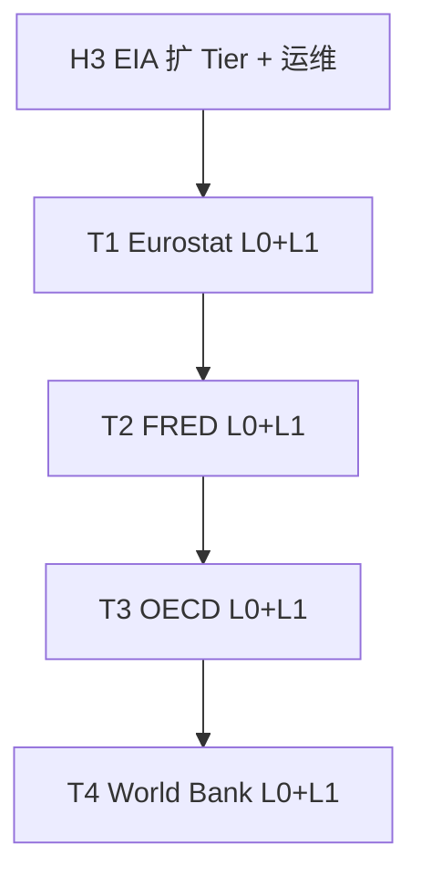

# 树形 API 多源完备采集实施方案

> **状态**：轨 T 已落地（H3 ✅ · T1–T4 ✅ · **P0 L1 加深 v2.1**）；**轨 T+ P1**：`imf` ✅ · `ecb` ✅（`census`/`bea`/`faostat` □）  
> **版本**：v2.2（2026-05-22）  
> **进度真源**：[实施进度总览.md](./实施进度总览.md) §4.11（轨 T）  
> **方法论**：[树形API数据源完备采集方法论.md](../knowledge/树形API数据源完备采集方法论.md)  
> **样板**：[EIA完备采集方案.md](./EIA完备采集方案.md)（✅ H0–H2 MVP）  
> **关联**：[行业维度接入设计方案.md](./行业维度接入设计方案.md)（Tier 与 `industry_tag` 对齐）· [data-sources.md](../data-sources.md)  
> **文档地图** → [README.md](../README.md)

---

## 1. 目标与范围

### 1.1 目标

在 **EIA H0–H2 已落地** 基础上，将「**目录完备（L0）+ 分层数据（L1/L2）**」模式复制到其余**具备可枚举子版块的宏观/指标源**，避免长期停留在「单 query / 硬编码 3–10 条样本」PoC。

**子版块（本方案用语）**：官方 API 可枚举、可分层浏览的采集单元，包括但不限于 EIA `routes[]`、Eurostat TOC 文件夹、SDMX `dataflow`、World Bank `topic`、BEA `dataset`→`TableName`、OpenAlex `topics`、PubMed MeSH 等。**不必**为严格 URL 路径树（见 [方法论 §7](../knowledge/树形API数据源完备采集方法论.md) 2026-05-22 增补）。

| 维度 | 验收口径 |
|------|----------|
| **L0** | 本地 catalog 表/快照与官网目录枚举一致（可 diff 告警） |
| **L1** | `config/<source>-routes.yml`（或等价）中 Tier A/B 条目可 `collect` 成功 |
| **L2** | 可选历史回填；受配额与存储约束，按源分轨 |

### 1.2 本方案覆盖源

| 源 | 官方目录形态 | 当前缺口 | 本方案 Phase |
|----|--------------|----------|--------------|
| **EIA** | `/v2` 树 + `/data` facet | L0 ✅；L1 **19** route + `eia-catalog-sync` 周 cron | **H3** ✅ |
| **Eurostat** | Catalogue TOC ~5.5k dataset | L0 ✅；L1 YAML **9** 条 + `eurostat-catalog-sync` | **T1** ✅ |
| **FRED** | Category 树 + 80 万 series | L0 ✅；L1 YAML **18** 条 + `fred-catalog-sync` | **T2** ✅ |
| **OECD** | SDMX `dataflow` ~1.5k | L0 ✅；L1 YAML **7** 条 + `oecd-catalog-sync` | **T3** ✅ |
| **World Bank** | `/indicator` + `/topic` | L0 ✅；L1 YAML **21** 条 + `worldbank-catalog-sync` | **T4** ✅ |

### 1.3 非目标

- **不**在本轨（H3–T4）改造 OpenAlex / CrossRef 等**纯查询驱动**源；若需主题子版块，走 **§14.4 已有 Connector 加目录层**（与轨 T+ 分列）。
- **不**承诺轨 T 五源「物理全量数值入库」；**目录完备 ≠ 全库观测完备**。
- **不**在本轨实现望野行业 ontology（见 [行业维度接入设计方案](./行业维度接入设计方案.md)）；仅预留 `raw_json` 字段与 YAML 注释对齐。
- **不**将轨 T+ 新 Connector 与 [波次 10 运维启用](./待接入数据源清单与波次方案.md#38-下一阶段-p1运维与平台2026-05-21) 混在同一 commit（新源按 §14.6 单独立项）。

### 1.4 实施铁律

与 [EIA完备采集方案 §8](./EIA完备采集方案.md) 及 `ai-task-integration.mdc` §3 一致：每 Phase 须 **migration + catalog CLI + collect 改造 + `config/*-routes.yml` + 单测 + `data-sources.md` + `.env.example`（若有新 ENV）** 同一主题 commit。

---

## 2. 现状差距（2026-05-22 代码审计）

| 源 | 官方子方向规模（官网） | L0 | L1 代码真源 | 子方向数据是否覆盖 |
|----|------------------------|-----|-------------|-------------------|
| EIA | 14 顶层 / **232** 叶子 | ✅ `pnpm cli eia catalog sync` | `config/eia-routes.yml` **23** 条（油气价/产量/储运） | 🟡 目录全、L1 加深 |
| Eurostat | TOC **~5 466** dataset | ✅ `pnpm cli eurostat catalog sync` | `config/eurostat-datasets.yml` **13** 条 | 🟡 目录全、L1 加深 |
| FRED | Category 树 + **80 万+** series | ✅ `pnpm cli fred catalog sync` | `config/fred-series.yml` **24** 条 Tier A | 🟡 目录 BFS、L1 加深 |
| OECD | 多 agency **dataflow** ~1.5k | ✅ `pnpm cli oecd catalog sync` | `config/oecd-series.yml` **7** 条 Tier A（+DEU/JPN KEI） | 🟡 目录全；API 拥塞时需错峰 `verify-oecd-series` |
| World Bank | **16 000+** indicator × topic | ✅ `pnpm cli worldbank catalog sync` | `config/worldbank-indicators.yml` **26** 条 | 🟡 目录全、L1 加深 |

**EIA 路由内 facet**：仅 `electricity/retail-sales` 声明 `sectorid`×`stateid` 白名单；其余已采 route 多为无 facet 默认页。

---

## 3. 总体路线图

| Phase | 工期（估） | 依赖 | 产出物摘要 |
|-------|-----------|------|------------|
| **H3** | 2–3d | EIA H0–H2 ✅ | ✅ 16 route · verify 16/16 · `eia-catalog-sync` · collect 500 冒烟 |
| **T1** | 3–4d | H3 模块模板可抄 | `eurostat_catalog` + `config/eurostat-datasets.yml` + CLI |
| **T2** | 3–4d | T1 验收通过 | `fred_series_catalog` + category BFS + YAML |
| **T3** | 2–3d | SDMX 经验来自 T1 | `oecd_dataflows` + 扩 KEI/增 1 flow |
| **T4** | 2d | 无硬依赖 | `worldbank_indicator_catalog` + topic 驱动 YAML |

**建议排期**：H3 与 T1 可并行（不同 Connector）；T2–T4 顺序实施，避免同时改 4 套 catalog 表。

### 3.1 轨 T 完成后优先级（2026-05-22）

| 优先级 | 动作 | 说明 |
|--------|------|------|
| **P0** | 轨 T 五源 **L1 加深** | ✅ v2.1：EIA **23** · Eurostat **13** · FRED **24** · WB **26** · verify 通过；OECD **7** 未扩（SDMX 500/429） |
| **P1** | 轨 **T+** 新 Connector | ✅ `imf` · `ecb`（L0+L1）；□ `census` / `bea` / `faostat`（§14.3） |
| **P2** | 已有源 **catalog 子命令** | `openalex` topics、`pubmed` MeSH 等（§14.4）；不新增 `sources.yml` id |

详表与官网依据 → **§14**。

---

## 4. Phase H3：EIA 收尾（扩 L1，巩固 L0）

> 真源：[EIA完备采集方案.md](./EIA完备采集方案.md) §4 Tier · §6 验证清单

### 4.1 步骤

| 步 | 动作 | 验收 |
|----|------|------|
| H3-1 | 跑通 `pnpm cli eia catalog sync`（`EIA_CATALOG_SKIP_PROBE=1` 可接受） | ✅ 232 叶子 · 14 顶层（`data/catalog/eia-routes-2026-05-21.json`） |
| H3-2 | 对照 L0 扩充 `config/eia-routes.yml`（目标 **12–20** 叶子） | ✅ **16** 条 · `verify-eia-routes.mjs` **16/16 OK**（2026-05-21） |
| H3-3 | 能源子方向代表 route：至少覆盖 `petroleum`、`electricity`、`natural-gas`、`coal` 各 1 条 | ✅ 已覆盖；`electricity/operating-generator-capacity` 替代易 503 的 `facility-fuel` |
| H3-4 | 高 facet route 补 YAML 白名单（参考 L0 `needs_facet_plan`） | ✅ `retail-sales` sector×state；`eia_max_facet_combos_per_route: 64` |
| H3-5 | Scheduler：`eia-catalog-sync`（L0）+ `eia` snapshot cron | ✅ `registerEiaCatalogSchedule` · `0 4 * * 0` · `GET /admin/schedules` → `maintenance` |
| H3-6 | （可选）`EIA_COLLECT_MODE=backfill` 对 1 条 Tier A 冒烟 | □ 非 H3 必验收；留 L2 |

### 4.2 不改代码时的运维动作

- `sources.yml`：`eia_tier_filter: "A,B"` 已开；确认 `collect_max_items` 与 Tier 规模匹配。
- 导出样例目录：`data/export/eia/{date}/` 用于 D1 回归。

---

## 5. Phase T1：Eurostat

### 5.1 官方能力

| 项 | 说明 |
|----|------|
| 目录 | [Catalogue API TOC](https://ec.europa.eu/eurostat/web/user-guides/data-browser/api-data-access/api-getting-started/catalogue-api)：`GET .../catalogue/toc/txt?lang=en`（约 5.5k dataset，按主题文件夹） |
| 数据 | Statistics API：`GET .../statistics/1.0/data/{code}?format=JSON&geo=...` |
| 子方向 | 主题树（能源 `nrg_*`、环境 `env_*`、经济 `nama_*`…）+ dataset 内 geo/unit/sector 维 |

### 5.2 实施步骤

| 步 | 路径 / 命令 | 说明 |
|----|-------------|------|
| T1-1 | `src/storage/migrations/025_eurostat_catalog.sql` | 表 `eurostat_catalog_datasets`：`code`、`title`、`theme_path`、`type`、`collect_enabled`、`tier`… |
| T1-2 | `src/connectors/eurostat/catalogCrawl.ts` | 解析 TOC txt/xml；BFS 文件夹节点；叶子 `type=dataset` 入库 |
| T1-3 | `src/cli/eurostatCommands.ts` | `pnpm cli eurostat catalog sync\|list [--theme]` |
| T1-4 | `config/eurostat-datasets.yml` | Tier A：**6–10** 条（`nama_10_gdp`、`une_rt_a`、`nrg_bal_c` 等）；每条声明 `params`（geo/unit/…） |
| T1-5 | 改 `eurostat.ts` `collect` | 由 `EUROSTAT_CORE_QUERIES` 常量 → 读 YAML + `resolveCollectRoutes`（仿 `eia.ts`） |
| T1-6 | `scripts/verify-eurostat-datasets.mjs` | 每条 YAML 返回 200 且 `value` 非空 |
| T1-7 | `src/__tests__/unit/eurostatCatalog.test.ts` | fixture TOC 片段 |
| T1-8 | `docs/data-sources.md` §6.5、`sources.yml` options | `eurostat_datasets_file`、`eurostat_tier_filter`、`eurostat_catalog_sync_enabled` |
| T1-9 | `registerCatalogSchedules` · `eurostat-catalog-sync` | 默认 `0 5 * * 0`；`GET /schedules` → `maintenance` |

### 5.3 Tier A 初始清单（建议，实施前用 L0 校验 code 存在）

| code | 主题 | 备注 |
|------|------|------|
| `nama_10_gdp` | 国民经济 | 已有；扩 multi-geo 或保持 EU27 |
| `une_rt_a` | 劳动 | 已有 |
| `demo_pjan` | 人口 | 已有 |
| `nrg_bal_c` | **能源** | 新增：能源平衡 |
| `env_air_gge` | **环境** | 新增：温室气体 |
| `ei_bssi_m_r2` | 景气 | 新增：经济景气指标 |

---

## 6. Phase T2：FRED

### 6.1 官方能力

| 项 | 说明 |
|----|------|
| 目录 | `fred/category`、`fred/category/children`（根 `category_id=0`）；`fred/category/series` |
| 数据 | `fred/series/observations` |
| 子方向 | 分类树分支（贸易、就业、货币、国际…）→ 每类数千 series |

### 6.2 实施步骤

| 步 | 路径 / 命令 | 说明 |
|----|-------------|------|
| T2-1 | `026_fred_catalog.sql` | `fred_catalog_categories`、`fred_catalog_series`（或合并 series 表 + `category_id`） |
| T2-2 | `src/connectors/fred/catalogCrawl.ts` | BFS `category/children`；可选对叶类 `category/series` 抽样登记 |
| T2-3 | `pnpm cli fred catalog sync\|list` | 进度 stderr；限速 2 rps |
| T2-4 | `config/fred-series.yml` | Tier A：每**顶层 category** 选 2–3 个代表 `series_id`（GDP、CPI、失业率等） |
| T2-5 | 改 `fred.ts` `collect` | YAML 驱动 `series/observations`；保留 `search` 作补充 |
| T2-6 | `scripts/verify-fred-series.mjs` | |
| T2-7 | 单测 + `FRED_API_KEY` 文档 | `credentials.ts` 已有 |
| T2-8 | `fred-catalog-sync` 周 cron | `fred_catalog_sync_enabled` · 默认 `0 6 * * 0` |

**注意**：不宜对 80 万 series 全量 L0；策略为 **category 全量 + series 按类抽样或仅登记 Tier A 显式 id**。

---

## 7. Phase T3：OECD

### 7.1 官方能力

| 项 | 说明 |
|----|------|
| 目录 | `GET https://sdmx.oecd.org/public/rest/dataflow`（及 `datastructure`） |
| 数据 | `GET .../data/{agency},{flowId}/{seriesKey}?format=jsondata` |
| 子方向 | 多 dataflow（KEI、QNA、教育…）；单 flow 内多 series key |

### 7.2 实施步骤

| 步 | 路径 / 命令 | 说明 |
|----|-------------|------|
| T3-1 | `027_oecd_catalog.sql` | `oecd_catalog_dataflows`：`agency`、`flow_id`、`name`、`tier` |
| T3-2 | `src/connectors/oecd/catalogCrawl.ts` | 拉 dataflow 列表；过滤 `OECD.SDD.*` 等 |
| T3-3 | `pnpm cli oecd catalog sync\|list` | |
| T3-4 | `config/oecd-series.yml` | 保留现有 4 KEI key；**新增** 1 个非 KEI flow（如环境/能源，实施前用 L0 选） |
| T3-5 | 改 `oecd.ts` | YAML + `OECD_CORE_QUERIES` 迁移 |
| T3-6 | `scripts/verify-oecd-series.mjs` | |
| T3-7 | `oecd-catalog-sync` 周 cron | `oecd_catalog_sync_enabled` · 默认 `0 7 * * 0` |

---

## 8. Phase T4：World Bank

### 8.1 官方能力

| 项 | 说明 |
|----|------|
| 目录 | `GET /v2/indicator` 分页；`GET /v2/topic`；指标带 `topics[]` |
| 数据 | `GET /v2/country/all/indicator/{code}?mrv=` |
| 子方向 | Topic（Economy、Energy、Climate…）→ 上万 indicator |

### 8.2 实施步骤

| 步 | 路径 / 命令 | 说明 |
|----|-------------|------|
| T4-1 | `028_worldbank_catalog.sql` | `worldbank_catalog_indicators`：`code`、`name`、`topic_ids` |
| T4-2 | `src/connectors/worldbank/catalogCrawl.ts` | 分页 `/indicator`；写 topic 关联 |
| T4-3 | `pnpm cli worldbank catalog sync\|list [--topic]` | |
| T4-4 | `config/worldbank-indicators.yml` | 按 **topic** 选 Tier A（替换 `CORE_INDICATORS` 常量） |
| T4-5 | 改 `worldbank.ts` | YAML 驱动；国家维改 **可配置** `countries: [US, CN, …]` 避免默认全国家 |
| T4-6 | `scripts/verify-worldbank-indicators.mjs` | |
| T4-7 | `worldbank-catalog-sync` 周 cron | `worldbank_catalog_sync_enabled` · 默认 `0 8 * * 0` |

---

## 9. 代码模块模板（跨源复用）

从 `src/connectors/eia/` 复制并改名：

| 职责 | EIA（已有） | Eurostat | FRED | OECD | World Bank |
|------|-------------|----------|------|------|------------|
| 目录爬取 | `catalogCrawl.ts` | `eurostat/catalogCrawl.ts` | `fred/catalogCrawl.ts` | `oecd/catalogCrawl.ts` | `worldbank/catalogCrawl.ts` |
| 路由清单 | `config/eia-routes.yml` | `eurostat-datasets.yml` | `fred-series.yml` | `oecd-series.yml` | `worldbank-indicators.yml` |
| collect 编排 | `eia.ts` | `eurostat.ts` | `fred.ts` | `oecd.ts` | `worldbank.ts` |
| CLI | `eiaCommands.ts` | `eurostatCommands.ts` | `fredCommands.ts` | `oecdCommands.ts` | `worldbankCommands.ts` |
| live 验证 | `verify-eia-routes.mjs` | `verify-eurostat-*.mjs` | `verify-fred-*.mjs` | `verify-oecd-*.mjs` | `verify-worldbank-*.mjs` |

**接入点**：`connectors/index.ts` · `bootstrap.ts` · `src/cli/index.ts` 子命令 · `sources.yml` `options` · `docs/data-sources.md`。

---

## 10. 验证清单（每 Phase 收尾）

| # | 命令 / 动作 | 通过标准 |
|---|-------------|----------|
| 1 | `pnpm cli <source> catalog sync` | 无未捕获异常；叶子/指标数与官网数量级一致 |
| 2 | `pnpm cli <source> catalog list` | Tier A/B 条目可读 |
| 3 | `node scripts/verify-<source>-*.mjs` | YAML 条目 HTTP 200 + 有观测 |
| 4 | `pnpm cli collect --source <id> --max-items N` | `raw_json` 含 route/dataset/series 键；`external_id` 稳定 |
| 5 | `timeout 120s pnpm build` | exit 0 |
| 6 | `pnpm test:run` 相关单测 | exit 0 |

---

## 11. 与行业维度、宏观去重

| 主题 | 做法 |
|------|------|
| **行业打标** | Tier A YAML 增注释 `# industry_tag: 能源`；[行业维度方案](./行业维度接入设计方案.md) Phase 2 可由 `sources.yml` `options.default_industry_tag` 注入 |
| **宏观重复** | `fred` / `worldbank` / `eurostat` / `oecd` / `eia` 同概念序列用 **显式选型**，`economic_indicators` 视图按 `source_id` 过滤；扩 Tier 时对照现有 `CORE_*` 避免同 ID 重复采 |
| **RAG** | 均为 `indicator` 分块；深度回填走 D2 镜像可选 |

---

## 12. 风险与缓解

| 风险 | 缓解 |
|------|------|
| Eurostat TOC 体积大（~1MB txt） | 流式解析；仅入库 `dataset` 行；文件夹路径作 `theme_path` |
| FRED category 过深 | `MAX_CATEGORY_DEPTH`；叶类才拉 series |
| OECD dataflow 列表变更 | 周级 L0；YAML diff CI |
| World Bank 全国家 × 多指标膨胀 | YAML 限制 `countries` + `mrv`；Tier C 仅目录 |
| 多 Phase 并行 merge 冲突 | 串行 T1→T4；H3 可与 T1 并行 |
| IMF API 限速 | 10 req/5s/IP；catalog sync 与 collect 分 job；复用 OECD 礼貌间隔 |
| Census ~1780 dataset | Discovery API 分页；按 Aggregate/Microdata/Timeseries 分表或 `dataset_type` 字段 |
| 宏观簇重复 | T+ 立项时对照 `fred`/`worldbank`/`eurostat`/`oecd`/`eia` YAML，同概念 **显式选型** |

---

## 14. 轨 T+：子版块扩展候选（规划）

> **状态**：□ 未实施（2026-05-22 评估入库）  
> **与轨 T 关系**：轨 T 五源优先 **L1 加深**；T+ 为**新 Connector** 或**已有 Connector 加 L0**，复用 §9 模块模板。  
> **排期真源**：[待接入数据源清单与波次方案.md](./待接入数据源清单与波次方案.md) §4.2（`imf`/`census` 由「按需」提升为 P1 候选）

### 14.1 轨 T 五源：后续动作（非新源）

| 源 | 子版块规模（官网） | 下一步 |
|----|-------------------|--------|
| EIA | 14 顶层 / 232 叶子 | 对照 L0 扩 `eia-routes.yml`；高 facet route 补白名单 |
| Eurostat | ~5.5k dataset | 按 `theme_path`（`nrg_*`、`env_*`…）扩 Tier A |
| FRED | category 树 | 按顶层/叶类扩 `fred-series.yml`；可选登记 `fred/releases` |
| OECD | ~1.5k dataflow | 扩非 KEI flow；API 拥塞时 `verify-oecd-series` 间隔重跑 |
| World Bank | 16 topic × 1.6 万+ indicator | 按 topic 扩 `worldbank-indicators.yml` |

### 14.2 新 Connector 候选（宏观/指标 · 可复用 T 轨模板）

| 优先级 | 规划 `id` | 子版块形态 | 官方目录入口 | profile / 备注 | 估工时 |
|--------|-----------|------------|--------------|----------------|--------|
| **P0** | `imf` | SDMX **dataflow**（WEO、CPI、BOP…） | [IMF Data APIs](https://data.imf.org/en/Resource-Pages/IMF-API) · `…/structure/dataflow` | `sdmx_json`（扩 base_url） | 2–3d（≈ T3） |
| **P0** | `ecb` | SDMX **dataflow**（EXR、BSI、MIR…） | [ECB API](https://data.ecb.europa.eu/help/api/data) · `GET …/service/dataflow` | `sdmx_json` | 2–3d |
| **P1** | `census` | **~1 780** dataset endpoint（Aggregate / Microdata / Timeseries） | [Census API Discovery](https://www.census.gov/data/developers/guidance.html) | 新 profile 或 `rest_query_param_key` + Key | 3–4d |
| **P1** | `bea` | **~15 dataset** → 内层 **TableName**（NIPA、Regional…） | `GETDATASETLIST` · [BEA API](https://www.bea.gov/resources/developer-tools) | `rest_query_param_key` + `BEA_API_KEY` | 2–3d |
| **P1** | `faostat` | **domain / dataflow**（QCL、FBS、RL…） | FAOSTAT SDMX · `…/rest/dataflow/all` | `sdmx_json`；农业垂直 | 3–4d |
| **P2** | `ilo` | SDMX dataflow | [ILOSTAT SDMX](https://sdmx.ilo.org/rest) | `sdmx_json` | 2d |
| **P2** | `bis` | SDMX dataflow | `https://stats.bis.org/api/v1` | `sdmx_json` | 2d |
| **P2** | `unsd` | SDMX（含 SDG） | UN `data.un.org` WS | `sdmx_json` | 2–3d |

**偏弱子版块（慎承诺 L0 完备）**：

| 规划 `id` | 子版块能到哪一层 | 局限 |
|-----------|-----------------|------|
| `bls` | **`/surveys`** + popular series | [BLS FAQ](https://www.bls.gov/developers/api_faqs.htm)：无全量 series 目录；宜 survey 级 L0 + YAML 代表 id |

**T+ 单源最小交付**（与 §1.4 一致）：migration + `catalogCrawl` + `pnpm cli <id> catalog sync|list` + `config/<id>-*.yml` + collect YAML 驱动 + `verify-*.mjs` + 单测 + `data-sources.md` + `sources.yml` +（若有 Key）`.env.example`。

### 14.3 已有 Connector：加目录层（不新增 `sources.yml` id）

| 已有 `id` | 可枚举子版块 | 官网依据 | 与行业维度 | 工作量 |
|-----------|-------------|----------|------------|--------|
| `openalex` | `/topics`、`/concepts` | [OpenAlex API](https://api.openalex.org) | 学术主题子版块 | 中 |
| `pubmed` | **MeSH** 树 | NCBI `einfo` / MeSH | 生物医学 | 中 |
| `clinicaltrials` | 条件、阶段、研究类型等 facet | [CT.gov API v2](https://clinicaltrials.gov/data-api/api) | 临床试验垂直 | 低–中 |
| `sec_edgar` | 表单类型（10-K/10-Q/8-K）+ SIC | SEC submissions | 监管文档 | 低 |
| `patentsview` / `epo_ops` / `google_patents` | CPC/IPC 分类 | 专利局体系 | 技术子版块 | 中 |
| `chembl` | target / mechanism 类型 | ChEMBL API | 医药化学 | 中 |
| `uniprot` | taxonomy、keyword | UniProt REST | 蛋白/物种 | 中 |
| `fred`（加深） | **`fred/releases`**（扩维） | FRED API | 宏观发布日历 | 低 |
| `github` / `youtube` | topic、`videoCategoryId` | 社区 API | 扁平标签，树浅 | 低 |

**不适配子版块目录完备**（保持查询/时间窗采集）：`crossref`、`semanticscholar`、`arxiv`/`arxiv_oai`、`hackernews`、`reddit`、`yahoo_finance`、`opencitations`、`core`。

### 14.4 建议实施顺序

1. **五源 L1 加深**（无新 migration，与运维可并行）。
2. **`imf` → `ecb`**：复用 `src/connectors/oecd/`、`sdmx_json` profile、`catalogSchedules.ts` 错峰 cron。
3. **`census` / `bea`**：补美国宏观三角（与 `fred`、`eia` 显式去重）。
4. **`faostat`**：农业垂直；与 `materials_project` 行业栈协同。
5. **已有源 catalog**：若推进 [行业维度方案](./行业维度接入设计方案.md)，优先 **OpenAlex topics + PubMed MeSH**。

### 14.5 与待接入清单的衔接

| 文档条目 | 本方案处置 |
|----------|------------|
| [待接入 §4.2](./待接入数据源清单与波次方案.md) `imf`、`census`「按需」 | 提升为 **轨 T+ P1**；单独立项，不并入波次 10 |
| 波次 10 `chembl`/`pubchem` 启用 | 与 T+ **无依赖**；勿在同一 commit 混宏观 catalog migration |

---

## 15. §变更记录

| 版本 | 日期 | 说明 |
|------|------|------|
| v2.2 | 2026-05-22 | **P1 轨 T+**：`imf` + `ecb` Connector（migration 029/030 · catalog CLI · YAML · verify · catalogSchedules 9/10 点） |
| v2.1 | 2026-05-22 | **P0 L1 第二轮加深**：五源 YAML +4~+6 条/源；`verify-*` 23/13/24/26 OK；OECD 维持 7 条（API 拥塞） |
| v2.0 | 2026-05-22 | **§14 轨 T+**：子版块术语、新 Connector/已有源候选、排期与风险；§1.3/§3.1 修订；链方法论 §7 |
| v1.9 | 2026-05-22 | **L0 cron**：`catalogSchedules.ts` 统一注册五源 maintenance；`sources.yml` 各 `*_catalog_sync_enabled` + 错峰周日 cron |
| v1.8 | 2026-05-22 | **L1 深化**：EIA 19 · Eurostat 9 · FRED 18 · OECD 7 · World Bank 21 条；verify 除 OECD API 拥塞外通过 |
| v1.7 | 2026-05-22 | T4 落地：World Bank L0 `worldbank_catalog_indicators` · CLI · YAML 15 条 · 可配置 `countries` · verify |
| v1.6 | 2026-05-22 | T3 收尾：`catalogFetch` JSON/XML 全量 + agency 分批 · XML 解析 · 目录 sync 验收 1516 条 |
| v1.5 | 2026-05-21 | T3 落地：OECD L0 `oecd_catalog_dataflows` · CLI · YAML 5 条（KEI×4 + AEA GHG）· verify |
| v1.4 | 2026-05-21 | T2 落地：FRED L0 `fred_catalog_categories` · CLI · YAML 13 条 Tier A · verify 13/13 |
| v1.3 | 2026-05-21 | T1 落地：Eurostat L0 `eurostat_catalog_datasets` · CLI · YAML 6 条 · verify 6/6 |
| v1.2 | 2026-05-21 | H3 收尾：`eia-catalog-sync` 周 cron · `scheduleMaintenance` · sources.yml options |
| v1.1 | 2026-05-21 | H3-2 落地：`eia-routes.yml` 16 条 · verify 16/16 · 实施进度 §4.11 更新 |
| v1.0 | 2026-05-21 | 初稿：H3 EIA 收尾 + T1–T4 分源步骤；现状差距表；模块模板与验证清单；链方法论与 EIA 方案 |
