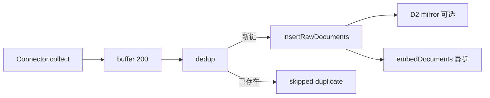
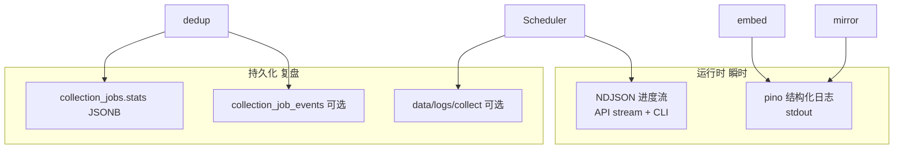

# 采集日志与可观测性设计方案

> **版本**：v1.3 · **状态**：**L1–L6 已全部实施**  
> **最后更新**：2026-05-19  
> **关联**：[design.md](../design.md) §五（流水线）、[实施进度总览.md](./实施进度总览.md) §3 L 轨、[storage-strategy.md](../storage-strategy.md) §4.2、[原始数据本地导出与镜像方案.md](./原始数据本地导出与镜像方案.md)、`src/processors/dedup.ts`、`src/scheduler/progress.ts`

---

## 1. 背景与问题

### 1.1 典型困惑（运维/开发）

执行 `pnpm cli collect --source openalex` 时常见输出：

```text
▶ openalex  job #12  since=2026-05-19
  · openalex  已抓取 200，新入库 0
  ✅ openalex: success (0 条)
```

**现象**：API 明显返回了数据，但 `items_collected = 0`，易被误判为「采集失败」或「无日志」。

**根因（当前实现）**：

| 指标 | 含义 | 代码 |
|------|------|------|
| 已抓取 `fetched` | Connector `yield` 的 `RawDocument` 条数 | `src/scheduler/index.ts` |
| 新入库 `itemsCollected` | `dedup` 后 **INSERT 的新行** 数（`newDocs.length`） | 同上 |
| 重复跳过 | `dedup` 已计算 `skippedCount`，**未上报** CLI/DB | `src/processors/dedup.ts` |

当库内已有相同 `(source_id, external_id)`（例如曾执行 `pnpm cli export`、历史采集、手动导入）时，**抓取 N、入库 0** 为预期行为，而非 API 故障。

### 1.2 现有「日志」分散且不可复盘

| 层级 | 能力 | 持久化 | 采集决策可见性 |
|------|------|--------|----------------|
| CLI NDJSON 进度 | `run_start` / `progress` / `run_done` | ❌ 会话结束即失 | 🟡 仅 `fetched` + `itemsCollected` |
| `collection_jobs` | status、items_collected、error_message | ✅ | 🟡 仅汇总，无 skipped |
| `config_audit_log` | 配置热更新 | ✅ | ❌ 与采集无关 |
| Fastify logger | HTTP 访问 | stdout/容器日志 | ❌ 无 per-doc |
| `console.error` | embed / mirror 失败 | 容器日志 | ❌ 不进 job |
| D1 export manifest | 导出已有行 | 磁盘 | ❌ 非采集过程 |
| D2 mirror manifest | **仅新插入** 行 | 磁盘 | 🟡 间接反映 inserted |
| D5 export `provenance` | 单文档 HTTP + curl | 磁盘 + `fetch_provenance` | ✅ 设计已定稿（□ 代码见 [原始数据本地导出与镜像方案 §4.7](./原始数据本地导出与镜像方案.md#47-数据来源溯源provenanced5)） |

**缺口摘要**：

1. **语义误导**：「已抓取」与「新入库」之间缺少「重复跳过」等中间态说明。  
2. **统计断链**：`dedup` 的 `skippedCount` 未进入 progress / `collection_jobs` / 汇总文案。  
3. **无采集审计**：无法事后回答「job #12 为何 0 入库、跳过了哪些 external_id」。  
4. **副路径静默**：Embedding、D2 镜像失败仅 `console.error`（设计债见 [数据源接入与 RAG 构建方案](./数据源接入与RAG构建方案.md) P1 建议）。  
5. **单文档 HTTP 溯源未写**：L3 已写 `collectionJobId`；**按请求**复现（curl / `batchRequest`）由 **D5** `fetch_provenance` 承担，与 L 轨 NDJSON 互补。

### 1.3 目标

| 能力 | 说明 |
|------|------|
| **运行时可读** | CLI/API 流式进度展示：抓取 / 新入库 / 重复跳过 /（可选）副路径告警计数 |
| **事后可复盘** | 按 `collection_job_id` 查询汇总与（可选）批次/抽样事件 |
| **入库标准文档化** | 与代码一致的「为何入库 / 为何跳过」判定表 |
| **不阻断主路径** | 写日志/落盘失败不得导致采集 job `failed`（与 D2、embed 相同） |

### 1.4 非目标（首版）

- 不替代 PostgreSQL 为主存储；日志为**观测副本**。  
- 不做全量 per-document 永久日志（默认仅汇总 + 可选抽样）。  
- 不实现望野主平台统一审计中心对接（预留 JSON 事件格式即可）。  
- 不改造 OpenAlex 等 Connector 的分页协议（日志只记录 `since` / filter 等已有参数）。

---

## 2. 入库与跳过标准（Canonical）

> **代码真源**：`src/processors/dedup.ts`、`src/storage/models/rawDocument.ts`  
> 实施本方案时，§2 与代码不一致视为 **bug**。

### 2.1 主路径判定



| 步骤 | 条件 | 结果 | 计入指标 |
|------|------|------|----------|
| 抓取 | Connector `yield` 一条 `RawDocument` | 进入 buffer | `fetched++` |
| 去重 | `(source_id, external_id)` **不在** `raw_documents` | `INSERT` | `inserted++`（= 现 `items_collected`） |
| 去重 | 键**已存在** | **跳过**，不调用 INSERT | `skippedDuplicate++` |
| Embedding | 新插入且 `raw_json.title` 非空 | 异步 `embedDocuments` | `embedQueued++`；失败 `embedFailed++` |
| D2 镜像 | 新插入且 `DATA_PLATFORM_RAW_MIRROR` 已设 | `mirrorInsertedDocuments` | `mirrorWritten++` / `mirrorSkipped++` |

**重要**：`insertRawDocuments` SQL 含 `ON CONFLICT DO UPDATE`，但 **`dedup` 在 INSERT 前用 `findExistingIds` 拦截已存在键**，故当前行为是「已存在则**不更新** `raw_json`」，而非 upsert 覆盖。

### 2.2 增量水位（与「重复抓取」）

| 字段 | 行为 |
|------|------|
| `collection_schedules.last_collected_at` | **仅 job `success` 后**设为 `now()`（`markScheduleCollectionSuccess`） |
| OpenAlex `since` | `toCollectSinceDate(last_collected_at)` → `filter=from_publication_date:{since}` |

因此：**即使本轮 `inserted = 0`，水位仍会前进**；下次仍可能请求「当日发表」作品，其中大量键已在库 → 反复出现「抓取 200、入库 0」。日志系统须显式展示 `skippedDuplicate`，避免误判。

### 2.3 建议统一的 `skipReason` 枚举（实施期）

| `skipReason` | 含义 | 首版 |
|--------------|------|------|
| `duplicate` | DB 已存在 `(source_id, external_id)` | ✅ |
| `invalid_external_id` | 无法规范化 ID（预留） | □ |
| `connector_filtered` | Connector 侧未 yield（预留） | □ |
| `max_items_cap` | 达到 `maxItems` 停止（预留） | □ |

首版仅实现 `duplicate`；CLI `--verbose` 可抽样打印 `external_id`。

---

## 3. 观测架构（目标态）

### 3.1 三层观测 + 统一 Logger



| 层 | 代号 | 消费者 | 失败策略 |
|----|------|--------|----------|
| **L0** | 终端 NDJSON | `pnpm cli collect`、脚本 | 与采集同请求；断连不影响 job |
| **L1** | Job 汇总 `stats` | `pnpm cli jobs`、`GET /admin/jobs` | 写库失败 → `console.error`，job 仍 `success` |
| **L2** | 事件表 / 文件 NDJSON | 运维、后续 Admin UI | 异步、可丢：不阻断 dedup |
| **L3** | pino 统一 Logger | Docker logs、集中日志栈 | 仅观测 |

### 3.2 与现有 `CollectProgressEvent` 的关系

当前类型定义：`src/scheduler/progress.ts`（`run_start` | `source_start` | `progress` | `source_done` | `run_done` | …）。

**扩展原则**：

- **向后兼容**：旧 CLI 忽略未知字段；旧 API 消费者仍可读 `fetched` / `itemsCollected`。  
- **新字段优先加在 `progress` 与 `source_done` / `run_done`**，避免破坏现有 `type` 判别。

---

## 4. 事件与数据模型

### 4.1 扩展后的 `progress` 事件（Phase A）

```typescript
{
  type: "progress";
  sourceId: string;
  jobId: number;
  fetched: number;           // 累计抓取
  inserted: number;        // 累计新入库（= 现 itemsCollected 语义）
  skippedDuplicate: number; // 累计重复跳过
  embedFailed?: number;     // Phase A 可选
  batchIndex?: number;      // 第几批 dedup（每 200 条）
}
```

**CLI 单行文案（默认）**：

```text
  · openalex  已抓取 200，新入库 0，重复跳过 200
```

**`source_done` 附带 `stats` 快照**（与入库 job 行一致）：

```typescript
{
  type: "source_done";
  job: CollectionJob;
  stats: CollectJobStats;  // 见 §4.2
}
```

### 4.2 `CollectJobStats`（Phase B — `collection_jobs.stats`）

建议 JSONB 结构（写入 `collection_jobs.stats`，`items_collected` 列保持 = `stats.inserted` 兼容旧读者）：

```json
{
  "fetched": 200,
  "inserted": 0,
  "skippedDuplicate": 200,
  "embedQueued": 0,
  "embedFailed": 0,
  "mirrorWritten": 0,
  "mirrorSkipped": 0,
  "since": "2026-05-19",
  "query": "",
  "connectorId": "openalex",
  "connectorFilter": "from_publication_date:2026-05-19",
  "batches": 1,
  "finishedAt": "2026-05-19T08:00:00.000Z"
}
```

**迁移草案**（`008_collection_job_stats.sql`）：

```sql
ALTER TABLE collection_jobs
  ADD COLUMN IF NOT EXISTS stats JSONB;

COMMENT ON COLUMN collection_jobs.stats IS '采集汇总：fetched/inserted/skippedDuplicate 等，见 plans/采集日志与可观测性设计方案.md §4.2';
```

### 4.3 `collection_job_events`（Phase C — 可选）

用于细粒度审计与 `pnpm cli jobs --job-id 12 --events`：

```sql
CREATE TABLE IF NOT EXISTS collection_job_events (
  id BIGSERIAL PRIMARY KEY,
  job_id BIGINT NOT NULL REFERENCES collection_jobs(id) ON DELETE CASCADE,
  ts TIMESTAMPTZ NOT NULL DEFAULT now(),
  level TEXT NOT NULL DEFAULT 'info',  -- debug | info | warn | error
  event_type TEXT NOT NULL,            -- batch_dedup | embed_fail | mirror_fail | skip_sample
  payload JSONB NOT NULL DEFAULT '{}'
);

CREATE INDEX IF NOT EXISTS idx_collection_job_events_job_ts
  ON collection_job_events(job_id, ts);
```

**`batch_dedup` payload 示例**：

```json
{
  "batchIndex": 1,
  "fetchedInBatch": 200,
  "insertedInBatch": 0,
  "skippedInBatch": 200,
  "skipSamples": ["W123", "W456"]
}
```

**体量控制**：默认每批只记汇总；`--verbose` 或 `COLLECT_LOG_SKIP_SAMPLES=5` 才写 `skip_sample`。

### 4.4 采集 NDJSON 落盘（Phase C — 文件）

| 变量 | 默认 | 说明 |
|------|------|------|
| `DATA_PLATFORM_COLLECT_LOG_DIR` | （未设置 = 关闭） | 如 `./data/logs/collect` |

路径：`{root}/{sourceId}/{jobId}/run.ndjson` — 与 API `stream=true` **同 schema**，由 **服务端** `collectRunner` 追加写入（CLI 断开仍可查）。

失败：`console.error`，不抛错。

---

## 5. 实施阶段

### Phase A — 进度可见（P0，约 0.5d）✅ L1

| 项 | 文件 | 说明 |
|----|------|------|
| A1 | `src/scheduler/index.ts` | ✅ 累加 `skippedCount`；`emitProgress` 带 `inserted` / `skippedDuplicate` |
| A2 | `src/scheduler/progress.ts` | ✅ `CollectJobStats` + 扩展 `CollectProgressEvent` |
| A3 | `src/cli/index.ts` | ✅ 进度行与 `source_done` 汇总文案 |
| A4 | `src/api/collectRunner.ts` | ✅ `source_done.stats` 由 scheduler 发出（经 NDJSON 透传） |
| A5 | 测试 | ✅ `scheduler-progress.test.ts` |

**验收**：`pnpm cli collect --source openalex` 在「全重复」场景显示 `重复跳过 N`；`pnpm test:run` 通过。

### Phase B — Job 级持久汇总（P1，约 0.5d）✅ L2 + L3

| 项 | 文件 | 说明 |
|----|------|------|
| B1 | `008_collection_job_stats.sql` | ✅ `collection_jobs.stats` |
| B2 | `src/storage/models/collectionJob.ts` | ✅ 读写 stats |
| B3 | `src/scheduler/index.ts` | ✅ job 结束时 `UPDATE stats` |
| B4 | `src/cli/index.ts` `jobs` | ✅ 展示 stats 摘要 |
| B5 | `src/scheduler/index.ts` | ✅ 新文档 `collection_job_id`（`stampJobId` → dedup） |

**验收**：`pnpm cli migrate` 后 `pnpm cli jobs --limit 1` 可见抓取/跳过；`psql` 可查 `stats` JSONB。

### Phase C — 文件日志 + 事件表（P2）✅ L4 + L5

| 项 | 说明 |
|----|------|
| C1 | ✅ `src/collect/logWriter.ts` + `collectRunner` 落盘 |
| C2 | ✅ `009_collection_job_events.sql` + `GET /jobs/:id/events` + `cli jobs --job-id --events` |
| C3 | ✅ `collect --verbose` / `COLLECT_LOG_SKIP_SAMPLES` → `skip_sample` |

### Phase D — 统一 Logger（P2）✅ L6

| 项 | 说明 |
|----|------|
| D1 | ✅ `src/lib/logger.ts`（pino）；`LOG_LEVEL` |
| D2 | ✅ `dedup` embed/mirror 失败 `logger.warn` + `collection_job_events` |
| D3 | ✅ `.env.example` |

---

## 6. CLI 与 API 约定

### 6.1 CLI

| 命令/参数 | 行为 |
|-----------|------|
| `collect`（默认） | 流式进度含 inserted / skippedDuplicate |
| `collect --verbose` | 每批最多 N 条 `skip_sample` 打印到终端 |
| `collect --json` | NDJSON 含新字段 |
| `jobs --limit N` | 若有 `stats`，打印「抓取/入库/跳过」 |
| `jobs --job-id ID [--events]` | Phase C：拉取 `collection_job_events` |

### 6.2 HTTP

| 端点 | 变更 |
|------|------|
| `POST /api/admin/collect` `stream=true` | `progress` / `source_done` 含扩展字段 |
| `GET /api/admin/jobs` | 响应含 `stats`（Phase B） |
| `GET /api/admin/jobs/:id/events` | Phase C（可选） |

父仓 [数据平台 API 协议](../knowledge/数据平台API协议.md) 若有采集章节，Phase B 后 **另 commit 父仓** 增补字段说明。

---

## 7. 环境变量

| 变量 | 默认 | Phase | 说明 |
|------|------|-------|------|
| `DATA_PLATFORM_COLLECT_LOG_DIR` | 关闭 | C | 采集 NDJSON 落盘根目录 |
| `COLLECT_LOG_SKIP_SAMPLES` | `0` | C | 每批写入事件的 skip 抽样条数 |
| `LOG_LEVEL` | `info` | D | pino 级别 |

同步落点：`.env.example`、`CLAUDE.md` 环境变量表、[实施进度总览.md](./实施进度总览.md) §2（实施后）。

---

## 8. 测试与验收

| 场景 | 预期 |
|------|------|
| 库内无新键 | `inserted > 0`，`skippedDuplicate` 低 |
| 库内已全部存在 | `fetched > 0`，`inserted = 0`，`skippedDuplicate ≈ fetched` |
| embed 失败 | job 仍 `success`；`stats.embedFailed > 0` 或 warn 日志 |
| mirror 失败 | 同 embed；不阻断采集 |
| API `stream=false` | 响应体含 `stats`（Phase B） |
| Docker 重建后 | CLI 与 API 字段一致 |

单测：`dedup` 返回 skippedCount → scheduler 累加；integration/api：`POST /collect?stream=true` 解析新字段。

---

## 9. 文档与代码同步清单

实施各 Phase 后 **同一主题 commit** 更新：

| 文档 | 章节 |
|------|------|
| 本文 | 文首 **状态** → ✅；§5 勾选 |
| [实施进度总览.md](./实施进度总览.md) | §2 代码真源、§3 L 轨任务状态 |
| [design.md](../design.md) | §五 流水线（设计） |
| [README.md](../../README.md) | CLI collect 说明（若有） |

---

## 10. 任务编号（实施进度总览 L 轨）

| ID | 条目 | Phase | 状态 |
|----|------|-------|------|
| **L1** | progress/CLI 展示 skippedDuplicate | A | ✅ |
| **L2** | `collection_jobs.stats` JSONB | B | ✅ |
| **L3** | `collectionJobId` 写入新文档 | B | ✅ |
| **L4** | `DATA_PLATFORM_COLLECT_LOG_DIR` 落盘 | C | ✅ |
| **L5** | `collection_job_events` + CLI | C | ✅ |
| **L6** | pino 统一 Logger | D | ✅ |

---

## 变更记录

| 版本 | 日期 | 说明 |
|------|------|------|
| v1.0 | 2026-05-19 | 初版：现状分析、入库标准、L0–L3 观测架构、Phase A–D、事件/表结构、CLI/API、L 轨任务 |
| v1.1 | 2026-05-19 | L1 落地：`progress`/`source_done.stats`/`skippedDuplicate`；`scheduler`+`cli`+单测 |
| v1.2 | 2026-05-19 | L2/L3：`008` 迁移、`collection_jobs.stats`、`collection_job_id`、cli jobs |
| v1.3 | 2026-05-19 | L4–L6：logWriter、009 events、pino、verbose/skip_sample |
