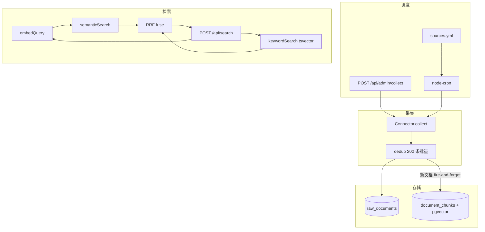

# data-platform 功能实现与设计总览

> **版本**：v1.7 · **最后同步**：2026-05-19  
> **代码基线**：`pnpm test:run` 135 passed；迁移 `001`–`010`；YAML **12** 源 / 运行时 **4** Connector  
> **维护约定**：实质交付后同步 [plans/实施进度总览.md](./plans/实施进度总览.md) 与本文件 §6–§8

---

## 目录

1. [项目定位与边界](#1-项目定位与边界)
2. [架构设计](#2-架构设计)
3. [数据模型与存储](#3-数据模型与存储)
4. [模块实现现状](#4-模块实现现状)
5. [数据源与 Connector](#5-数据源与-connector)
6. [配置系统](#6-配置系统)
7. [采集与处理流水线](#7-采集与处理流水线)
8. [RAG 检索](#8-rag-检索)
9. [HTTP API](#9-http-api)
10. [CLI 与运维](#10-cli-与运维)
11. [调度系统](#11-调度系统)
12. [与望野 / engine-core 对接](#12-与望野--engine-core-对接)
13. [部署与测试](#13-部署与测试)
14. [路线图与已知缺口](#14-路线图与已知缺口)
15. [文档索引](#15-文档索引)

---

## 1. 项目定位与边界

### 1.1 在望野三层架构中的位置

data-platform 是望野 monorepo 中的**数据层子包**（`packages/data-platform`），与主平台 Next.js、引擎包 `engine-core` 独立部署、独立数据库。

```
┌──────────────────────────────────────────────┐
│  望野平台 (Next.js) — 展示、权限、审计        │
├──────────────────────────────────────────────┤
│  engine-core — DAG 工作流、LLM、引用管理      │
│  ↑ SearchProvider contract 消费检索结果       │
├──────────────────────────────────────────────┤
│  data-platform — 采集、存储、RAG（本包）      │
└──────────────────────────────────────────────┘
```

**设计命题**（见 [design.md](./design.md) §一）：构建 AI 可「持续提问、自由探索、廉价试错、真实反馈」的闭环数据基础设施。

### 1.2 职责边界（设计 vs 实现）

| 职责 | data-platform | engine-core / 主平台 |
|------|:-------------:|:--------------------:|
| 多源数据采集 | ✅ | ❌ |
| 原始/向量存储（PostgreSQL + pgvector） | ✅ | ❌ |
| 语义 + 关键词混合检索 | ✅ | ❌ |
| 知识图谱（Neo4j） | □ Phase 3 | ❌ |
| 定时采集调度 | ✅ node-cron | ❌ |
| LLM 调用、Prompt、引用校验 | ❌ | ✅ |
| 用户会话与权限 | ❌ | ✅ |
| LLM 摘要 `summarizeContext` | ❌ | ✅（消费检索结果后摘要） |

**关键设计决策（v0.2）**：不提供 `/api/context` 等 LLM 摘要端点；检索结果经 HTTP 返回后，由 engine-core 负责理解与注入 `knowledgeContext`。

### 1.3 设计原则（已实现部分）

| 原则 | 实现情况 |
|------|----------|
| Connector 与存储分离 | ✅ Connector 产出 `RawDocument[]`，由 `dedup` 写库 |
| 原始数据不可变 | ✅ `raw_documents` 仅追加；唯一键 `(source_id, external_id)` |
| 异步流水线阶段 | 🟡 采集→去重→Embedding 已通；富化/段落分块未做 |
| 多消费者复用 | 🟡 REST + adapter 已备；父仓尚未接入 |
| 先窄后宽 | ✅ MVP 4 Connector + 12 源 YAML 占位 |

---

## 2. 架构设计

### 2.1 六层架构（设计目标）

| 层 | 设计职责 | 实现路径 | 状态 |
|----|----------|----------|------|
| L6 API | REST 检索、运维、健康 | `src/api/` Fastify | ✅ |
| L5 RAG | Embedding、向量检索、RRF | `src/rag/` | ✅ |
| L4 处理 | 去重、分块、富化 | `src/processors/dedup.ts` | 🟡 仅去重+单 chunk |
| L3 存储 | PostgreSQL + pgvector | `src/storage/` | ✅ |
| L2 采集 | Connector → RawDocument | `src/connectors/` | 🟡 4/12 源 |
| L1 调度 | Cron + 手动触发 | `src/scheduler/` | ✅ YAML 驱动 |

### 2.2 端到端数据流（当前实现）



### 2.3 技术选型（设计 vs 实际）

| 组件 | 设计文档 | 当前实现 |
|------|----------|----------|
| 主库 | PostgreSQL 16 | ✅ 独立库 `data_platform` |
| 向量 | pgvector | ✅ 迁移 `002_pgvector.sql` |
| 图库 | Neo4j Phase 3 | □ 未开始 |
| HTTP | Fastify | ✅ |
| 调度 | node-cron → BullMQ | ✅ node-cron；BullMQ 未做 |
| Embedding | Voyage / OpenAI | ✅ 另支持 **Ollama bge-m3**（Docker 默认） |
| ORM | Prisma（设计草案） | 实际为 **原生 `pg` 池** |

---

## 3. 数据模型与存储

### 3.1 已实现表（迁移 `001`–`009`）

| 迁移 | 主要内容 |
|------|----------|
| `001_init.sql` | `data_sources`、`raw_documents`、`collection_jobs`、`collection_schedules`、FTS GIN |
| `002_pgvector.sql` | `document_chunks`、向量列、ivfflat |
| `003_layer2_views.sql` | 检索用视图/字段（title、snippet 等） |
| `004_crossref.sql` | CrossRef 源元数据 |
| `005_config.sql` | `config_audit_log`、配置热更新审计 |
| `006_worldbank.sql` | World Bank 源 |
| `007_incremental_schedule.sql` | `last_collected_at` 增量采集 |
| `008_collection_job_stats.sql` | `collection_jobs.stats` JSONB（L2 采集汇总） |
| `009_collection_job_events.sql` | `collection_job_events` 审计事件（L5） |
| `010_fetch_provenance.sql` | `raw_documents.fetch_provenance` JSONB（D5） |

### 3.2 核心实体（设计完整度 vs 代码）

| 实体 | 设计（design.md §三） | 代码/表 |
|------|----------------------|---------|
| DataSource | 完整 | ✅ `data_sources` |
| CollectionJob | 完整 | ✅ `collection_jobs` |
| RawDocument | 不可变 JSONB + 可选 HTTP 溯源 | ✅ `raw_documents` + `fetch_provenance`（D5） |
| CollectionSchedule | cron + 增量 | ✅ + `last_collected_at` |
| EnrichedDocument | 富化层 | □ 未建表；检索从 `raw_json` 视图提取 |
| DocumentChunk | 分块 + 向量 | ✅ 单文档 MVP 一 chunk |
| Entity / EntityRelation | 图谱 | □ Phase 3 |
| DataSourceAuth | 加密凭证 | □ 凭证走 `process.env` |

### 3.3 环境变量（强制独立库）

| 变量 | 必须 | 说明 |
|------|:----:|------|
| `DATA_PLATFORM_DATABASE_URL` | 是 | **禁止**回退父项目 `DATABASE_URL` |
| `EMBED_BACKEND` | 否 | `ollama`（默认）/ `openai` / `voyage` |
| `EMBED_API_URL` / `EMBED_API_KEY` | 视后端 | Ollama 默认 `http://localhost:11434` |
| `OPENALEX_API_KEY` | 否 | 提高 OpenAlex 配额 |
| `NCBI_API_KEY` | 否 | PubMed E-utilities |
| `CROSSREF_MAILTO` | 建议 | CrossRef polite pool |
| `PORT` | 否 | 默认 `3400` |
| `SOURCES_CONFIG_PATH` | 否 | 默认 `config/sources.yml` |

---

## 4. 模块实现现状

### 4.1 目录与职责

```
src/
├── index.ts                 # 服务入口：DB → config sync → Scheduler → Fastify
├── types.ts                 # 全包类型（Connector、Search、Job…）
├── adapters/engineCore.ts   # SearchProvider 适配（子包内，待父仓注入）
├── api/
│   ├── server.ts            # buildApp / createServer
│   └── routes/              # search, health, admin
├── cli/index.ts             # 9+ 顶层命令、config 子命令
├── config/                  # YAML v1.1、expand、sync、runtime
├── connectors/                # BaseConnector + 4 实现 + factory/bootstrap
├── processors/dedup.ts      # 去重入库 + 触发 embedding
├── rag/                     # embed、vectorStore、retriever、searchFilters
├── scheduler/               # Scheduler、bootstrap(B13)、scheduleReport(B14)
└── storage/                 # db 池、migrations、models
```

### 4.2 功能矩阵总览

| 能力域 | 设计状态 | 实现状态 | 备注 |
|--------|----------|----------|------|
| Phase 1 MVP 骨架 | 已定稿 | ✅ | 见 design.md §十 |
| Phase 2 RAG | 已定稿 | ✅ | 混合检索 + 多 Embedding 后端 |
| Phase 3 知识图谱 | 规划 | □ | Neo4j、实体关系 |
| Phase 4 平台化 | 规划 | □ | BullMQ、Webhook、开放 API Key |
| 配置 v1.1 interface_profiles | 已定稿 | ✅ | B9–B12 |
| YAML 驱动 cron | 已定稿 | ✅ | B13 |
| 调度可观测 | 已定稿 | ✅ | B14 CLI + API |
| 增量采集 `since` | 已定稿 | ✅ | A5 |
| 父仓 DataPlatformClient | 已定稿 | □ | **C2 P0** |
| engine-core 注入 searchProvider | 已定稿 | □ | **C3**，依赖 C2 |
| 望野 admin 数据源页 | 已定稿 | □ | C4 |

---

## 5. 数据源与 Connector

### 5.1 注册一览（YAML vs 运行时）

`config/sources.yml` 登记 **12** 个源；`registerDefaultConnectors` 仅注册 **4** 个。

| source `id` | YAML `enabled` | 运行时 Connector | 单测 | 许可/商用 |
|-------------|:--------------:|:----------------:|:----:|-----------|
| `openalex` | ✅ | ✅ `OpenAlexConnector` | E2E/集成 | CC0 / ✅ |
| `crossref` | ✅ | ✅ `CrossRefConnector` | ✅ 21 | varies / ✅ |
| `worldbank` | ❌ | ✅ `WorldBankConnector` | ✅ 12 | CC BY / ✅ |
| `pubmed` | ❌ | ✅ `PubMedConnector` | ✅ 5 | 公有领域 / ✅ |
| `semanticscholar` | ❌ | ❌ | — | 非商用免费 / ❌ |
| `arxiv` | ❌ | ❌ | — | 元数据免费 / ✅ |
| `patentsview` | ❌ | ❌ | — | 公有领域 / ✅ |
| `sec_edgar` | ❌ | ❌ | — | 公有领域 / ✅ |
| `fred` | ❌ | ❌ | — | 需核实商用 / ❌ |
| `clinicaltrials` | ❌ | ❌ | — | 公有领域 / ✅ |
| `github` | ❌ | ❌ | — | 按仓库 / ✅ |
| `hackernews` | ❌ | ❌ | — | free / ✅ |

**默认 cron 仅对**：`enabled: true` **且** 已 `registerConnector` 的源——当前为 **openalex、crossref**（每日 7:00 / 8:00）。

### 5.2 BaseConnector 能力（已实现）

| 能力 | 路径 | 状态 |
|------|------|------|
| 令牌桶限速 | `connectors/rateLimiter.ts` | ✅ |
| 指数退避重试 | `connectors/backoff.ts` | ✅ |
| Offset 分页 | `connectors/base.ts` `paginateOffset` | ✅ |
| 异步迭代 `collect()` | `BaseConnector` | ✅ |
| 运行时配置合并 | `factory.ts` `resolveConnectorConfig` | ✅ 四源已接 DB `base_url` |

### 5.3 Connector 接口契约

```typescript
// 设计 + 实现一致（src/types.ts）
interface Connector {
  readonly meta: ConnectorMeta;
  collect(params?: CollectParams): AsyncIterable<RawDocument>;
  search?(query: string, opts?): Promise<SearchResult[]>;  // 部分源实现
  fetchById?(externalId: string): Promise<RawDocument | null>;
}
```

`CollectParams.since` 来自 `collection_schedules.last_collected_at`（A5），用于增量收窄采集范围。

---

## 6. 配置系统

### 6.1 配置优先级链（设计 + 实现）

```
环境变量 > 数据库 data_sources > sources.yml（展开后）> Connector META 默认值
```

| 模块 | 路径 | 功能 |
|------|------|------|
| 加载 | `config/loader.ts` | 解析 YAML v1.0 / v1.1 |
| 展开 | `config/expand.ts` | `interface_profiles` + `sources` → 平铺源列表 |
| 同步 | `config/sync.ts` | 启动时写入 `data_sources` |
| 运行时 | `config/runtime.ts` | Connector 读 DB `base_url`、options |
| 运维文件 | `config/sources.yml` | 12 源 + 11 个 profile 模板 |

### 6.2 Admin 热更新（API 已实现，CLI 暂缓）

| 能力 | 状态 | 说明 |
|------|------|------|
| `PUT /api/admin/sources/:id` | ✅ | 更新 `base_url`、`status` 等；写 `config_audit_log` |
| CLI `source-update` / `config-history` | ⏸ | 设计在 [外部数据源配置热更新方案](./plans/外部数据源配置热更新方案.md)，暂缓 |

### 6.3 配置 CLI（离线）

| 命令 | 作用 |
|------|------|
| `config validate` | 校验 YAML 结构与 profile 引用 |
| `config sync` | YAML → 数据库 |
| `config diff` | YAML 与 DB 差异 |
| `config export` | DB → v1.1 YAML |
| `config profiles` | 列出 interface_profiles |
| `config list --by-profile` | 按 profile 分组（读 YAML） |
| `config list` | 读 API/DB 运行时状态（需 serve） |

---

## 7. 采集与处理流水线

### 7.1 设计目标流水线

```
采集 → 去重 → [富化] → [段落分块] → Embedding → 检索
```

### 7.2 当前实现

| 阶段 | 状态 | 实现 |
|------|------|------|
| 采集 | ✅ | `Scheduler.runCollection`；200 条批量 `dedup` |
| 去重 | ✅ | `(sourceId, externalId)`；已存在跳过 |
| 富化（实体/分类） | □ | 设计在 processors/enrich；未实现 |
| 分块 | 🟡 | MVP：title + abstract **单 chunk**；段落级 A8 未做 |
| Embedding | ✅ | 新文档 `embedDocuments`（异步，失败仅日志） |
| Embedding 队列/重试 | □ | A9 明确暂缓 |
| 原始 JSON 导出（D1） | ✅ | `pnpm cli export`；[方案](./plans/原始数据本地导出与镜像方案.md) |
| 采集镜像写盘（D2） | ✅ | `DATA_PLATFORM_RAW_MIRROR`；`src/export/mirror.ts` |
| 导出/入库数据来源溯源（D5） | 🟡 | `010` + `src/lib/httpCapture.ts` + pubmed/openalex/crossref；[§4.7](./plans/原始数据本地导出与镜像方案.md#47-数据来源溯源provenanced5) |
| **采集日志与可观测性（L 轨）** | ✅ L1–L6 | [方案](./plans/采集日志与可观测性设计方案.md)；stats/落盘/events/pino |

**注意**：Embedding 为 fire-and-forget；无队列、无自动重试（见 [下一阶段实施方案](./plans/下一阶段实施方案.md) §5）。本地磁盘为 PG 副本，检索仍以 `raw_documents` 为准。

### 7.3 采集日志与可观测性（L1–L6 ✅）

> 详案：[plans/采集日志与可观测性设计方案.md](./plans/采集日志与可观测性设计方案.md)

| 能力 | 用法 |
|------|------|
| 流式进度 + 跳过统计 | `pnpm cli collect --source openalex` |
| 任务汇总持久化 | `pnpm cli jobs`（`collection_jobs.stats`） |
| 事件审计 | `pnpm cli jobs --job-id 12 --events` |
| NDJSON 落盘 | `DATA_PLATFORM_COLLECT_LOG_DIR=./data/logs/collect` |
| 重复 ID 抽样 | `collect --verbose` 或 `COLLECT_LOG_SKIP_SAMPLES=5` |
| 结构化日志 | `LOG_LEVEL=info`（pino） |

**入库标准（摘要）**：

| 判定 | 行为 |
|------|------|
| `(source_id, external_id)` 不存在 | INSERT → 计 `inserted`（现 `items_collected`） |
| 已存在 | 跳过，不更新 `raw_json` |
| job `success` 后 | `last_collected_at` 前进（即使 `inserted=0`） |

**目标分阶段**：Phase A 扩展 NDJSON/CLI 文案 → Phase B `collection_jobs.stats` JSONB → Phase C 落盘 NDJSON + 可选 `collection_job_events` → Phase D pino 统一 Logger。

---

## 8. RAG 检索

### 8.1 检索管线

1. **并行**：`embedQuery(query)` + `keywordSearch`（`tsvector` / `ts_rank`）
2. **语义**：`semanticSearch`（pgvector cosine）
3. **融合**：RRF（`k=60`），`src/rag/retriever.ts` `fuse` + `hybridSearch`
4. **降级**：仅语义或仅关键词
5. **过滤**：`sourceIds`、`commercialUse`、`dateFrom`/`dateTo`（`searchFilters.ts`）

### 8.2 Embedding 后端

| 后端 | 默认模型 | 维度 | 典型场景 |
|------|----------|------|----------|
| `ollama` | bge-m3 | 1024 | Docker 默认，无外部 API |
| `openai` | text-embedding-3-small | 1536 | 云端 |
| `voyage` | voyage-3-large | 1024 | 学术向 |

实现：`src/rag/embed.ts`；批量入库：`src/rag/vectorStore.ts`。

### 8.3 与设计的差异

| 设计（早期） | 现状 |
|--------------|------|
| 独立 Qdrant | 已改为 **pgvector**（零额外基础设施） |
| 多 chunk / 段落级 | 仍为 **每文档 1 chunk** |
| Voyage 为 MVP 推荐 | 生产 Docker 默认 **Ollama** |

---

## 9. HTTP API

路由注册：`src/api/server.ts`（`buildApp` 可供 smoke inject 测试）。

### 9.1 端点一览

| 方法 | 路径 | 状态 | 说明 |
|------|------|------|------|
| GET | `/health` | ✅ | DB 连通 + 源统计摘要 |
| POST | `/api/search` | ✅ | 混合检索 |
| GET | `/api/sources` | ✅ | 数据源列表（含 `last_fetch`） |
| POST | `/api/admin/collect` | ✅ | 单源或全部 `active` 源采集 |
| GET | `/api/admin/jobs` | ✅ | 任务历史 |
| GET | `/api/admin/schedules` | ✅ | 运行中 cron（B14 live） |
| GET | `/api/admin/stats` | ✅ | 文档/源/任务统计 |
| PUT | `/api/admin/sources/:id` | ✅ | 配置热更新 + 审计 |

### 9.2 检索请求示例

```bash
curl -X POST http://localhost:3400/api/search \
  -H "Content-Type: application/json" \
  -d '{
    "query": "transformer attention",
    "maxResults": 10,
    "filters": {
      "sourceIds": ["openalex", "crossref"],
      "commercialUse": true,
      "dateFrom": "2020-01-01"
    }
  }'
```

响应字段：`title`、`url`、`snippet`、`sourceId`、`sourceName`、`score`、`license`、`commercialUse`（详见 [knowledge/数据平台API协议.md](./knowledge/数据平台API协议.md)）。

### 9.3 认证与安全（设计 vs 现状）

| 项 | 设计 | 现状 |
|----|------|------|
| 服务间认证 | 内部网络 + 可选 API Key | **无认证**（假定内网） |
| 限流 | middleware | □ 未实现 |
| 外部源探活写入 `/health` | B8 | □ 未做 |

---

## 10. CLI 与运维

### 10.1 命令一览

| 命令 | 模式 | 状态 |
|------|------|------|
| `search` | HTTP → API | ✅ 支持 filters 参数 |
| `collect` | HTTP | ✅ |
| `sources` / `jobs` / `stats` | HTTP | ✅ |
| `health` | HTTP | ✅ |
| `schedules` / `schedules --live` | 本地 + 可选 HTTP | ✅ B14 |
| `migrate` | 本地 DB | ✅ 顺序执行 001–009 |
| `export` | 本地 DB | ✅ D1 原始 JSON 导出 |
| `serve` | 本地 | ✅ 等同 `src/index.ts` |
| `config *` | 本地 YAML/DB | ✅ 见 §6.3 |

### 10.2 测试分层

| 层级 | 命令 | 依赖 | 说明 |
|------|------|------|------|
| L0 | `pnpm test:run` | 无 DB | 单元 + smoke inject |
| L1 | `pnpm cli config validate` | YAML | 配置离线 |
| **L2-fast（I 轨）** | `pnpm test:integration` | Docker DB `:5433` | collect→embed→search→SearchProvider ✅ |
| L2-full | `pnpm test:integration:full` | DB + Ollama | I 轨 + 真实 bge-m3 |
| L2-live | `pnpm smoke:live` | DB + serve | 运维探活，不替代 I 轨 |

详案：[plans/集成测试最小闭环方案.md](./plans/集成测试最小闭环方案.md)

---

## 11. 调度系统

### 11.1 组件

| 组件 | 职责 |
|------|------|
| `Scheduler` | 注册 Connector、cron、`trigger` 手动采集 |
| `registerSchedulesFromConfig` | B13：仅 `enabled` + 有 Connector + 合法 cron |
| `collectionSchedule` 模型 | `last_collected_at`、`last_run_at` |
| `scheduleReport.ts` | CLI/API 可读的调度报告 |
| `cronNext.ts` | 下次执行时间（cron-parser） |

### 11.2 触发方式

| 方式 | 入口 |
|------|------|
| 自动 cron | 启动时 `registerSchedulesFromConfig` |
| 手动 | `POST /api/admin/collect` 或 `pnpm cli collect` |
| 全量 active | `collect` 无 `sourceId` 时查 `data_sources.status=active` |

---

## 12. 与望野 / engine-core 对接

### 12.1 子包内已就绪

`src/adapters/engineCore.ts` 提供：

```typescript
createDataPlatformSearchProvider(baseUrl?: string): SearchProvider
// → POST {baseUrl}/api/search → { title, url, snippet }[]
```

- 契约测试：`src/__tests__/smoke/engineCore-adapter.test.ts`（mock fetch）
- **I 轨闭环** ✅：`pipeline-closed-loop.test.ts` + `createDataPlatformSearchProvider` 真 HTTP
- 与 `packages/engine-core/ENGINE_CONTRACTS.md` 的 SearchProvider 字段对齐

### 12.2 父仓缺口（C2–C4，未落地）

全仓检索 `DataPlatformClient` / `createDataPlatformSearchProvider`：**仅 data-platform 子包内存在**。

| 任务 | 内容 | 状态 |
|------|------|------|
| **C2** | 父仓 `DataPlatformClient`（`search`、`getSources`、`triggerCollect`） | □ P0 |
| **C3** | engine-core `EngineServices.searchProvider` 注入 | □ P0，依赖 C2 |
| **C4** | 望野 `admin` 数据源监控/采集页 | □ P2 |

详细集成点矩阵见 [plans/平台接入设计框架.md](./plans/平台接入设计框架.md)：

| 集成点 | 说明 | 优先级 |
|--------|------|--------|
| A | 工作流 `buildPrompts` 知识注入 | P0 |
| B | 全局搜索栏扩展 | P1 |
| C | 行业页数据富化 | P2 |
| D–E | 管理后台监控/手动采集 | P1–P2 |
| F | 内部 cron | ✅ 已实现 |

### 12.3 推荐接入流程（设计）

```
engine-core buildPrompts
  ├→ callSerper()           # 实时网页（保留）
  └→ searchProvider.search() # data-platform 深度知识库
       └→ summarizeContext() # engine-core LLM 摘要后注入 state
```

data-platform **不**调用 LLM；分工线见 [design.md](./design.md) §9.4。

---

## 13. 部署与测试

### 13.1 Docker Compose

| 服务 | 端口 | 说明 |
|------|------|------|
| app | 3400 | Fastify API + Scheduler |
| db | 5433 | `pgvector/pgvector:pg16` |
| ollama | 11434 | 可选，默认 Embedding |

```bash
docker compose up -d --build          # 生产
docker compose -f docker-compose.dev.yml up -d --build  # 热重载
```

### 13.2 本地开发

```bash
pnpm install
pnpm cli migrate
ollama pull bge-m3   # 若用默认 Embedding
pnpm dev             # 或 pnpm cli serve
```

### 13.3 质量门禁（接 C2/C3 前）

1. `pnpm test:run`（必须，L0）
2. `pnpm test:integration`（推荐，L2-fast I 轨；需 `docker compose up -d db`）
3. `pnpm test:integration:full`（可选，L2-full + Ollama）
4. `pnpm smoke:live`（运维 smoke，不替代 I 轨）

I 轨可在**不依赖父仓**情况下验证 C2/C3 等价的 HTTP 消费路径。

---

## 14. 路线图与已知缺口

### 14.1 任务轨道（A / B / C）

详见 [plans/实施进度总览.md](./plans/实施进度总览.md) §3–§4。

**当前 P0（平台价值）**

- C2 `DataPlatformClient`
- C3 engine-core `searchProvider` 注入

**数据面 P1**

- A4 Semantic Scholar Connector
- **D1/D2** 原始数据导出 + 采集镜像（[方案](./plans/原始数据本地导出与镜像方案.md)）
- **D5** 数据来源溯源：`provenance` 结构化 + `curl`、单条/批次、入库（同上 §4.7 / §13）
- B8 外部 API 探活（可选）

**质量 P2**

- A8 段落级分块
- A7 arXiv OAI-PMH
- C4 admin 数据源页

**明确暂缓**

- A9 Embedding 队列（日均量小，手工重跑）
- 12 源 Connector 齐做（ROI 低）
- Phase 3 Neo4j 知识图谱

### 14.2 结构性缺口摘要

| 缺口 | 影响 |
|------|------|
| 父仓未接 data-platform | 望野生成/审校无法使用知识库检索 |
| 8 源仅 YAML 无 Connector | 配置可见但无法采集 |
| 单 chunk + 异步 Embedding 无重试 | 长文检索粒度粗；失败需人工处理 |
| 无 API 认证 | 仅适合内网；公网需补 middleware |
| `EnrichedDocument` / 图谱未建 | 复杂实体关系查询不可用 |

### 14.3 设计文档与代码一致性维护

每次交付后建议更新：

1. [plans/实施进度总览.md](./plans/实施进度总览.md) §2 代码真源
2. 本文件 §5–§8、§14
3. [design.md](./design.md) §十 Phase 勾选

---

## 15. 文档索引

### 15.1 按用途

| 用途 | 文档 |
|------|------|
| **本总览** | [功能实现与设计总览.md](./功能实现与设计总览.md)（本文） |
| **代码↔任务真源** | [plans/实施进度总览.md](./plans/实施进度总览.md) |
| **架构主设计** | [design.md](./design.md) |
| **Phase 1 归档** | [phase1-plan.md](./phase1-plan.md) |
| **下一阶段排期** | [plans/下一阶段实施方案.md](./plans/下一阶段实施方案.md) |
| **Connector / RAG** | [plans/数据源接入与RAG构建方案.md](./plans/数据源接入与RAG构建方案.md) |
| **配置 v1.1** | [plans/数据源配置-interface-profile实施方案.md](./plans/数据源配置-interface-profile实施方案.md) |
| **热更新** | [plans/外部数据源配置热更新方案.md](./plans/外部数据源配置热更新方案.md) |
| **平台对接** | [plans/平台接入设计框架.md](./plans/平台接入设计框架.md) |
| **原始数据落盘** | [plans/原始数据本地导出与镜像方案.md](./plans/原始数据本地导出与镜像方案.md) |
| **采集日志 / 可观测性** | [plans/采集日志与可观测性设计方案.md](./plans/采集日志与可观测性设计方案.md) |
| **集成测试最小闭环（I 轨）** | [plans/集成测试最小闭环方案.md](./plans/集成测试最小闭环方案.md) |
| **HTTP 契约** | [knowledge/数据平台API协议.md](./knowledge/数据平台API协议.md) |
| **外部 API 分类** | [knowledge/免费数据源接口分类分析.md](./knowledge/免费数据源接口分类分析.md) |
| **快速上手** | [README.md](../README.md) |
| **engine-core 契约** | [../engine-core/ENGINE_CONTRACTS.md](../engine-core/ENGINE_CONTRACTS.md) |
| **Agent 工作流** | [agent-workflow.md](./agent-workflow.md) |

### 15.2 plans 目录

见 [plans/README.md](./plans/README.md)。

---

## 变更记录

| 版本 | 日期 | 说明 |
|------|------|------|
| v1.0 | 2026-05-19 | 初版：整合 design.md、实施进度总览、代码真源与 plans/knowledge 索引 |
| v1.1 | 2026-05-19 | §7.2/§14/§15：登记 D1 导出 + D2 镜像设计（待实施） |
| v1.2 | 2026-05-19 | D1/D2/D3 已落地：`src/export/*`、`cli export`、compose volume |
| v1.3 | 2026-05-19 | §7.3/§14/§15：新增 L 轨《采集日志与可观测性设计方案》（待实施） |
| v1.4 | 2026-05-19 | §7.3：L1 落地（skippedDuplicate 进度/CLI） |
| v1.5 | 2026-05-19 | §3.1/§7.3：L2/L3（008 stats、collection_job_id、cli jobs） |
| v1.6 | 2026-05-19 | §3.1/§7.2/§14：登记 D5 Provenance（`fetch_provenance`、信封 v2）；待实施 |
| v1.7 | 2026-05-19 | §10.2/§12.1/§13.3/§15：I 轨 I1–I6 落地；测试 135+ |
